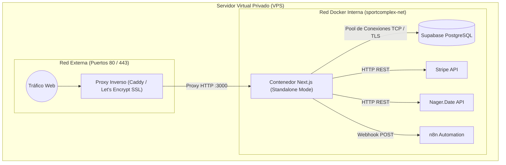

# ARQUITECTURA OBJETIVO DEL SISTEMA: SPORTCOMPLEX

## 1. Control del Documento y Trazabilidad de Artefactos

* **Proyecto:** Plataforma de Gestión de Reservas, Venta y Control de Acceso Deportivo (`SportComplex`)
* **Estado:** Arquitectura de Referencia y Especificación Técnica
* **Entorno de Despliegue Objetivo:** Virtual Private Server (VPS) basado en Contenedores Docker
* **Zona Horaria Canónica:** Colombia (`America/Bogota`, UTC-5)
* **Documentos Vinculados:**
  * **`SRS.md`**: Especificación Formal de Requisitos del Sistema. Establece las directrices funcionales (RF-00 a RF-21), restricciones no funcionales de concurrencia y seguridad (RNF-01 a RNF-06), e invariantes de negocio (RN-01 a RN-14).
  * **`DESIGN.md`**: Sistema de diseño unificado, tokens de color, componentes atómicos (`@sportcomplex/ui`), microinteracciones y lineamientos visuales diferenciados por perfil (Cliente, Taquilla POS, Escáner Móvil, Administración). La selección final de iconografía, utilitarios de clases y librerías atómicas complementarias se define en este documento.
  * **`MER_&_DER.md`**: Modelo Entidad-Relación y Diagrama Entidad-Relación relacional físico para PostgreSQL/Supabase, definición de constraints de exclusión temporal, índices B-Tree/GiST y normalización transaccional.

---

## 2. Visión y Principios Arquitectónicos

La arquitectura de **SportComplex** se concibe como una solución web fullstack monolítica modular optimizada mediante un **Monorepo gobernado por Turborepo y pnpm workspaces**, empaquetada para su ejecución autónoma en un VPS:

1. **Aislamiento de Responsabilidades:** Las reglas de negocio residen en módulos puros agnósticos al framework web (`@sportcomplex/core`), garantizando que la orquestación de disponibilidad, festivos y precios sea portable y verificable de forma aislada.
2. **Defensa en Profundidad y Cero Confianza:** Autorización mediante Control de Acceso Basado en Roles (RBAC) evaluada en el Middleware perimetral y validada en cada API Route, esquemas de entrada blindados en bordes mediante Zod y persistencia transaccional contra sobreventas.
3. **Estandarización de Interfaces:** Consumo de datos transversal a través de contratos tipados de extremo a extremo (TypeScript) compartidos entre backend y frontend.
4. **Infraestructura Contenedorizada Inmutable:** Despliegue en VPS orquestado por Docker Compose y compilación Next.js en modo `standalone`, minimizando la superficie del sistema operativo anfitrión y asegurando reproducibilidad total.

---

## 3. Matriz de Versiones Específicas y Congelación de Dependencias

Para eliminar discrepancias de compilación y fijar la línea base del proyecto, las dependencias confirmadas se congelan en versiones estables exactas (sin el uso de comodines `^` o `~`):

### 3.1. Entorno de Ejecución, Monorepo y Core
* **Node.js:** `22.14.0` (LTS)
* **pnpm:** `12.6.0`
* **Turborepo (`turbo`):** `2.11.4`
* **Next.js (`next`):** `16.3.7`
* **React / React DOM:** `19.0.0`
* **TypeScript:** `5.7.3`

### 3.2. Persistencia y Capa de Datos (Supabase / PostgreSQL)
* **Prisma CLI (`prisma`):** `7.10.0`
* **Prisma Client (`@prisma/client`):** `7.10.0`
* **Supabase Client (`@supabase/supabase-js`):** `2.49.1`
* **Supabase SSR Helper (`@supabase/ssr`):** `0.5.2`

### 3.3. Interfaz de Usuario y Estilos (Línea Base Confirmada)
> **Nota de Alcance:** La suite detallada de utilidades atómicas, paquete de iconografía (ej. Lucide, Phosphor, Tabler u otros) y librerías auxiliares de animación/accesibilidad se encuentra abierta y pendiente de ratificación en el documento `DESIGN.md`. La base tecnológica ratificada para fast UI/UX shipping se limita a:
* **Tailwind CSS (`tailwindcss`):** `4.3.3`
* **Shadcn UI CLI (`shadcn`):** Latest CLI de inicialización de componentes sobre Tailwind v4

### 3.4. Validación, Pagos y Utilidades del Sistema
* **Zod:** `4.6.5`
* **Stripe Node SDK (`stripe`):** `22.6.2`
* **Stripe JS Frontend (`@stripe/stripe-js` / `@stripe/react-stripe-js`):** `5.0.0` / `3.1.1`
* **Generación de QR (`qrcode`):** `1.5.4`
* **Escaneo de QR (`html5-qrcode`):** `2.3.8`
* **Manejo de Fechas y Zonas Horarias (`date-fns` / `date-fns-tz`):** `4.1.0` / `3.2.0`
* **Cliente HTTP Resiliente (`ky`):** `1.7.5`

---

## 4. Política Estricta de Renderizado: SSG, SSR y CSR

El rendimiento de la plataforma y el aprovechamiento de recursos exigen la delimitación rigurosa de los modos de renderizado de Next.js App Router según el caso de uso:

### 4.1. Static Site Generation (SSG) y Redirección Perimetral
* **Ubicación Física:** Reside estrictamente en el grupo de rutas `apps/web/src/app/(public)`.
* **Alcance:** Sitio Web Estático Institucional (Landing Page en raíz `/`) y páginas de reglamentos e instalaciones.
* **Comportamiento:**
  * Compilación estática pura (`export const dynamic = 'force-static'`) sin consumo de CPU por petición para garantizar LCP < 1.5 segundos.
  * Exposición de catálogo fotográfico de instalaciones, horarios generales y reglamentos institucionales.
  * **Intercepción Perimetral en `middleware.ts`:** El middleware inspecciona los tokens de sesión en el borde previo al despacho del HTML estático. Si el usuario cuenta con una sesión autenticada activa, ejecuta de forma inmediata una redirección 307 al portal web correspondiente según su rol (`/portal` para clientes, `/pos` para vendedores, `/scanner` para lectores, `/admin` para administradores). Los visitantes anónimos reciben de inmediato el HTML estático de la landing page.

### 4.2. Server-Side Rendering (SSR)
* **Alcance:** Vistas autenticadas que requieren datos frescos y seguros:
  * Historial de Compras y Reservas del Cliente (`/portal/history`).
  * Estado de Membresías (`/portal/membership`).
  * Consola Administrativa y Catálogo de Servicios (`/admin/services`).
  * Panel Gerencial de Analítica y Reportes (`/admin/analytics`).
* **Comportamiento:**
  * Renderizado bajo demanda en el servidor con streaming progresivo vía `React Suspense`.
  * La consulta de datos se efectúa directamente en el servidor sin exponer credenciales de infraestructura al cliente, enviando el HTML enriquecido de forma inmediata.

### 4.3. Client-Side Rendering (CSR)
* **Alcance:** Módulos de interacción dinámica continua y uso de APIs nativas del navegador:
  * **Motor de Reserva y Checkout:** Selección interactiva de franjas horarias, temporizador visible del TTL de 30 minutos e inyección de campos de pago de Stripe.
  * **Taquilla POS Presencial:** Interfaz optimizada para el Empleado Vendedor con selector de productos y orquestación del diálogo de impresión en formato PDF.
  * **Escáner Web Móvil (`/scanner`):** Acceso directo a la cámara del dispositivo vía `MediaDevices.getUserMedia`, decodificación de video en tiempo real (latencia < 400 ms) y selector de puesto por turno.
* **Comportamiento:**
  * Encapsulado en componentes marcados con directiva `'use client'`.
  * Consumo estricto de endpoints REST internos expuestos en `/api/*` para todas las operaciones mutacionales y de verificación.

---

## 5. Estructura de Directorios del Repositorio (Tree)

```text
sport-complex/
├── .github/
│   └── workflows/
│       ├── ci.yml                     # Verificación de lint, typecheck y contratos
│       └── deploy.yml                 # Build de Docker y despliegue continuo en VPS
├── docker/
│   ├── Dockerfile.web                 # Contenedor multi-stage optimizado para Next.js
│   ├── docker-compose.yml             # Orquestación del stack de producción en el VPS
│   └── Caddyfile                      # Proxy inverso Caddy con SSL automático
├── apps/
│   └── web/                           # Aplicación Fullstack Unificada Next.js
│       ├── public/
│       │   ├── images/                # Activos estáticos de instalaciones
│       │   └── branding/              # Isotipos y logotipos institucionales
│       ├── src/
│       │   ├── app/                   # App Router de Next.js
│       │   │   ├── (public)/          # Rutas públicas institucionales (SSG)
│       │   │   │   ├── layout.tsx     # Layout público institucional (Nav/Footer)
│       │   │   │   ├── page.tsx       # Landing Page de entrada y vitrina (RF-00)
│       │   │   │   └── legal/         # Reglamentos y condiciones estáticas
│       │   │   ├── (auth)/            # Autenticación y recuperación de cuentas
│       │   │   │   ├── login/
│       │   │   │   ├── register/
│       │   │   │   └── verify/        # Verificación con token temporal 15 min (RF-02)
│       │   │   ├── (customer)/        # Portal Privado del Cliente (SSR + CSR)
│       │   │   │   ├── portal/
│       │   │   │   │   ├── layout.tsx
│       │   │   │   │   ├── page.tsx
│       │   │   │   │   ├── book/      # Flujo de reserva y checkout Stripe (RF-08, RF-09)
│       │   │   │   │   ├── tickets/   # Billetera digital y descarga PDF (RF-10, RF-12)
│       │   │   │   │   └── membership/# Suscripciones recurrentes y 30% desc (RF-16)
│       │   │   ├── (staff)/           # Operaciones operativas del personal
│       │   │   │   ├── pos/           # Punto de Venta Cashless y PDF (RF-17)
│       │   │   │   └── scanner/       # Control de Acceso Móvil Puesto/Consulta (RF-13, RF-14)
│       │   │   ├── (admin)/           # Consola de Administración Central
│       │   │   │   ├── admin/
│       │   │   │   │   ├── dashboard/ # Analítica, afluencia y recaudación (RF-21)
│       │   │   │   │   ├── services/  # Configuración de categorías y aforos (RF-03, RF-04)
│       │   │   │   │   ├── employees/ # Gestión de personal y borrado lógico (RF-18)
│       │   │   │   │   └── incident/  # Inhabilitación y webhook n8n (RF-19)
│       │   │   ├── api/               # API Routes (Backend REST)
│       │   │   │   ├── auth/          # Callbacks OAuth y verificación
│       │   │   │   ├── bookings/      # Bloqueo temporal 30 min y confirmaciones
│       │   │   │   ├── payments/      # Webhook de Stripe y sesiones de pago
│       │   │   │   ├── access/        # Validación de lectura QR y consumo de tiquetes
│       │   │   │   ├── pdf/           # Endpoint para emisión de comprobante en PDF
│       │   │   │   └── webhooks/      # Receptores y disparadores (n8n, contingencia)
│       │   │   └── layout.tsx         # Layout raíz con proveedores globales
│       │   ├── middleware.ts          # Control RBAC y redirección perimetral de Landing
│       │   └── styles/
│       │       └── globals.css        # Configuración base de Tailwind CSS v4
│       ├── next.config.ts             # Configuración de Next.js (output: 'standalone')
│       ├── package.json
│       └── tsconfig.json
├── packages/
│   ├── core/                          # Reglas de negocio e integraciones de dominio
│   │   ├── src/
│   │   │   ├── domain/                # Modelos de dominio y tipos abstractos
│   │   │   ├── services/              # Orquestadores de lógica pura
│   │   │   │   ├── pricing.ts         # Cálculo tarifario y descuento del 30% (RN-08)
│   │   │   │   ├── availability.ts    # Ventana 15 días y multirreserva (RN-01, RN-07)
│   │   │   │   ├── pool-policy.ts     # Mantenimiento y festivos Nager.Date (RN-02)
│   │   │   │   └── access-control.ts  # Validación de servicio y vigencia horaria (RN-06)
│   │   │   ├── integrations/          # Conectores desacoplados para servicios externos
│   │   │   │   ├── nager-date.ts      # Cliente de festivos nacionales de Colombia
│   │   │   │   ├── stripe.ts          # Integración con pasarela 100% cashless
│   │   │   │   └── n8n.ts             # Cliente de eventos para flujos de contingencia
│   │   │   └── security/              # Generación de tokens y firmado HMAC de QR
│   │   ├── package.json
│   │   └── tsconfig.json
│   ├── db/                            # Capa de datos con Prisma ORM sobre Supabase
│   │   ├── prisma/
│   │   │   ├── schema.prisma          # Definición del esquema relacional
│   │   │   └── migrations/            # Historial de migraciones SQL versionadas
│   │   ├── src/
│   │   │   ├── client.ts              # Instancia singleton de Prisma Client
│   │   │   └── repositories/          # Consultas transaccionales y SELECT FOR UPDATE
│   │   ├── package.json
│   │   └── tsconfig.json
│   ├── ui/                            # Sistema de componentes compartidos (@sportcomplex/ui)
│   │   ├── src/
│   │   │   ├── components/            # Componentes base Shadcn (Button, Dialog, Card, etc.)
│   │   │   ├── templates/             # Plantillas de Simulación de Impresión PDF
│   │   │   │   └── ticket-receipt.tsx # Comprobante optimizado para exportación/impresión
│   │   │   └── lib/                   # Funciones utilitarias
│   │   ├── package.json
│   │   └── tsconfig.json
│   ├── validation/                    # Esquemas Zod y Contratos de Validación
│   │   ├── src/
│   │   │   ├── auth.schema.ts         # Validación de credenciales y activación
│   │   │   ├── booking.schema.ts      # Validación de solicitudes de reserva
│   │   │   ├── access.schema.ts       # Validación de lectura de QR y turnos
│   │   │   └── service.schema.ts      # Validación de parámetros del catálogo
│   │   ├── package.json
│   │   └── tsconfig.json
│   └── config/                        # Configuraciones de compilación y linter
│       ├── eslint/
│       └── typescript/
├── .npmrc                             # Resolución determinista y bloqueo de dependencias
├── package.json                       # Raíz del Workspace
├── pnpm-lock.yaml                     # Archivo de bloqueo congelado
├── pnpm-workspace.yaml                # Declaración de miembros del Monorepo
├── README.md
└── turbo.json                         # Pipeline de orquestación de caché y compilación

```

---

## 6. Módulos del Sistema y Workspaces

### 6.1. Workspace de Aplicación (`apps/web`)

* **Propósito:** Actúa como host de la aplicación Next.js App Router, integrando las vistas de usuario, la API REST interna y el middleware de protección.
* **Límites de Dominio:** Consume las bibliotecas internas y expone la interfaz de usuario. No implementa algoritmos de negocio directamente ni formula queries de base de datos sin el repositorio de `@sportcomplex/db`.

### 6.2. Workspace de Negocio e Integraciones (`packages/core`)

* **Propósito:** Aloja la lógica pura e invariantes del sistema.
* **Componentes Clave:**
* **Holiday Engine:** Orquesta la verificación de festivos en Colombia con `date.nager.at`, trasladando el mantenimiento rutinario de piscinas de lunes a martes ante días festivos. Mantiene estrategia de contingencia mediante caché relacional local.


* **Booking & Lock Engine:** Gobierna la ventana de 15 días, la validación de solapamientos y la gestión del bloqueo temporal atómico de 30 minutos en checkout.


* **Cashless Engine:** Administra la creación de intenciones de cobro y suscripciones recurrentes con Stripe, aplicando el 30% de descuento automático a usuarios con membresía vigente.


* **Access Engine:** Resuelve la lógica de acceso validando coincidencia de servicio según el puesto seleccionado por el empleado o ejecutando el modo consulta informativo sin consumo de boleto.


### 6.3. Workspace de Persistencia (`packages/db`)

* **Propósito:** Centraliza la conexión con PostgreSQL en Supabase, el esquema de Prisma y las migraciones.
* **Control de Concurrencia Crítica (RNF-01):** Implementa el bloqueo transaccional de franjas horarias y cupos mediante sentencias con bloqueo de fila (`SELECT ... FOR UPDATE`), impidiendo colisiones de compra simultánea sobre el mismo espacio o capacidad de aforo.


### 6.4. Workspace de Interfaz y Emisión PDF (`packages/ui`)

* **Propósito:** Provee la biblioteca de componentes basada en Shadcn UI y Tailwind CSS v4, estructurada según las pautas de `DESIGN.md`.
* **Motor de Simulación PDF (RNF-05):** Contiene la maqueta estructurada del comprobante digital (con código QR centralizado e información del servicio y titular) preparada para descarga virtual e invocación del diálogo nativo de impresión del navegador sin requerir impresoras de hardware.


### 6.5. Workspace de Validación de Contratos (`packages/validation`)

* **Propósito:** Define los esquemas Zod consumidos bidireccionalmente por el backend y el frontend. Exporta los esquemas de parseo de datos y los tipos TypeScript inferidos automáticamente.

---

## 7. Arquitectura de Despliegue en VPS y Contenedorización

La solución descarta el despliegue directo sobre el sistema operativo anfitrión del VPS y adopta una infraestructura basada en contenedores Docker:



### 7.1. Estrategia de Compilación: Next.js Standalone Mode

* La aplicación se configura con `output: 'standalone'` en `next.config.ts`.
* Esta directiva rastrea las dependencias en tiempo de compilación y genera una distribución mínima y autónoma, descartando herramientas de desarrollo y empaquetando un servidor Node.js optimizado (~180 MB en imagen final).

### 7.2. Pipeline de Contenedorización Multi-Stage (`Dockerfile.web`)

El proceso de construcción del contenedor se divide en cuatro fases declarativas:

1. **Base:** Node.js Alpine base con `pnpm` habilitado.
2. **Dependencies:** Instalación limpia de dependencias utilizando `pnpm fetch` y `pnpm install --frozen-lockfile` aprovechando la caché del monorepo.
3. **Builder:** Generación del cliente de Prisma (`prisma generate`), validación de contratos y compilación optimizada con Turborepo (`turbo run build --filter=web...`).
4. **Runner:** Imagen de producción no privilegiada (`USER nodejs`), copia de los artefactos compilados (`.next/standalone`, `.next/static` y `public`), exponiendo el puerto `3000`.

### 7.3. Orquestación y Proxy Inverso (`docker-compose.yml` & `Caddyfile`)

* **Proxy Inverso Edge (Caddy):** Actúa como terminador SSL/TLS automático con emisión y renovación desatendida de certificados Let's Encrypt. Canaliza el tráfico de los puertos 80/443 hacia el contenedor de Next.js.
* **Seguridad de Red:** La aplicación Next.js no expone sus puertos directamente al exterior del VPS; la comunicación se restringe a la red interna privada de Docker (`sportcomplex-net`).
* **Ejecución de Migraciones:** Las migraciones de base de datos (`prisma migrate deploy`) se ejecutan como un contenedor efímero (*init-container*) previo al levantamiento de la aplicación principal para asegurar que la base de datos se encuentre sincronizada antes de recibir tráfico.

---

## 8. Directrices de Seguridad y Control de Acceso

### 8.1. Autenticación y Ciclo de Vida de Cuentas

* **Google OAuth 2.0:** Los usuarios autenticados mediante el proveedor federado adquieren inmediatamente el estado `Activo`.


* **Registro Local (Correo/Contraseña):** Contraseñas cifradas mediante hash seguro (BCrypt costo $\ge 12$). La cuenta se crea en estado `Pendiente` y se despacha un token criptográfico con TTL improrrogable de 15 minutos y rate limit de 60 segundos para reenvíos.


### 8.2. Integridad de Boletos Digitales (QR)

* El código QR codifica un identificador global (UUIDv4) vinculado a una firma criptográfica HMAC-SHA256 generada en servidor con clave secreta.
* El módulo de acceso valida la firma previo a cualquier consulta a la base de datos, mitigando ataques de falsificación de identificadores.

### 8.3. Control de Acceso Basado en Roles (RBAC) y Borrado Lógico

* **Middleware Perimetral:** Valida tokens de sesión y restringe las rutas:
* `/admin/*` y `/api/admin/*`: Exclusivo para rol `Administrador`.


* `/pos/*` y `/api/pos/*`: Exclusivo para `Administrador` y `Empleado Vendedor`.


* `/scanner/*` y `/api/access/*`: Exclusivo para `Administrador` y `Empleado Lector`.


* `/portal/*`: Clientes en estado `Activo`.


* **Borrado Lógico (RN-10):** El personal no se elimina de la base de datos; la revocación de un empleado actualiza su estado a `Inactivo`, provocando la invalidación inmediata de sus credenciales en el Middleware y preservando el historial operativo intacto.


---

## 9. Convenciones del Repositorio y Flujo de Trabajo

### 9.1. Estrategia de Ramas (Git Flow Ágil)

* **Rama `main`:** Código de producción congelado y desplegado de forma continua en el VPS.
* **Rama `develop`:** Rama principal de integración continua.
* **Ramas de Funcionalidad (`feature/`):** Nomenclatura obligatoria estandarizada:
* `feature/auth-provider-email`
* `feature/catalog-services-slots`
* `feature/booking-lock-ttl`
* `feature/pool-nager-holidays`
* `feature/pos-stripe-cashless`
* `feature/scanner-access-modes`
* `feature/pdf-receipt-simulation`
* `feature/membership-recurring-discount`
* `feature/admin-analytics-dashboard`
* `feature/contingency-n8n-webhook`


* **Commits:** Cumplimiento estricto de la especificación *Conventional Commits* (`feat:`, `fix:`, `refactor:`, `perf:`, `chore:`).

### 9.2. Convenciones de Nomenclatura

* **Archivos y Directorios:** Estricto `kebab-case` en todo el proyecto (ejemplo: `pool-policy.ts`, `receipt-document.tsx`).
* **Componentes Visuales:** Nomenclatura en `PascalCase` con exportaciones nombradas (salvo páginas, layouts y rutas obligadas por Next.js).
* **Esquemas de Validación:** Archivos finalizados en `.schema.ts` exportando el esquema y el tipo asociado.
* **Endpoints API:** Mantenimiento bajo convención `route.ts` estructurando métodos HTTP explícitos (`GET`, `POST`, `PATCH`).

### 9.3. Formato Unificado de Respuestas API

Todas las rutas API internas responderán de manera predecible bajo el formato canónico JSON:

* **Respuesta Exitosa:**
* Estructura: `{ success: true, data: T, timestamp: ISO8601 }`


* **Respuesta de Error:**
* Estructura: `{ success: false, error: { code: string, message: string, details?: unknown }, timestamp: ISO8601 }`


* **Códigos HTTP Estandarizados:** `400` para errores de validación de datos, `401` para sesiones ausentes o expiradas, `403` para violaciones de RBAC, `409` para conflictos de cupo/aforo ocupado o bloqueado, y `500` para incidentes no controlados.

### 9.4. Resiliencia de Integraciones de Terceros

* **Nager.Date API:** Patrón de consulta con tiempo límite estricto de 2.5 segundos. En caso de timeout o caída de la API pública, el servicio recurre a la tabla local `HolidayCache` en base de datos sin detener la operación de reservas de piscinas.


* **Webhooks de Stripe:** Verificación obligatoria de la firma del payload y procesamiento con idempotencia registrando el identificador del evento de Stripe para evitar cobros dobles o activaciones repetidas.


* **Disparador n8n (Placeholder de Contingencia):** Despacho desacoplado y no bloqueante; los fallos de red en el endpoint de n8n no revierten la cancelación administrativa ni el bloqueo de las instalaciones en la base de datos.