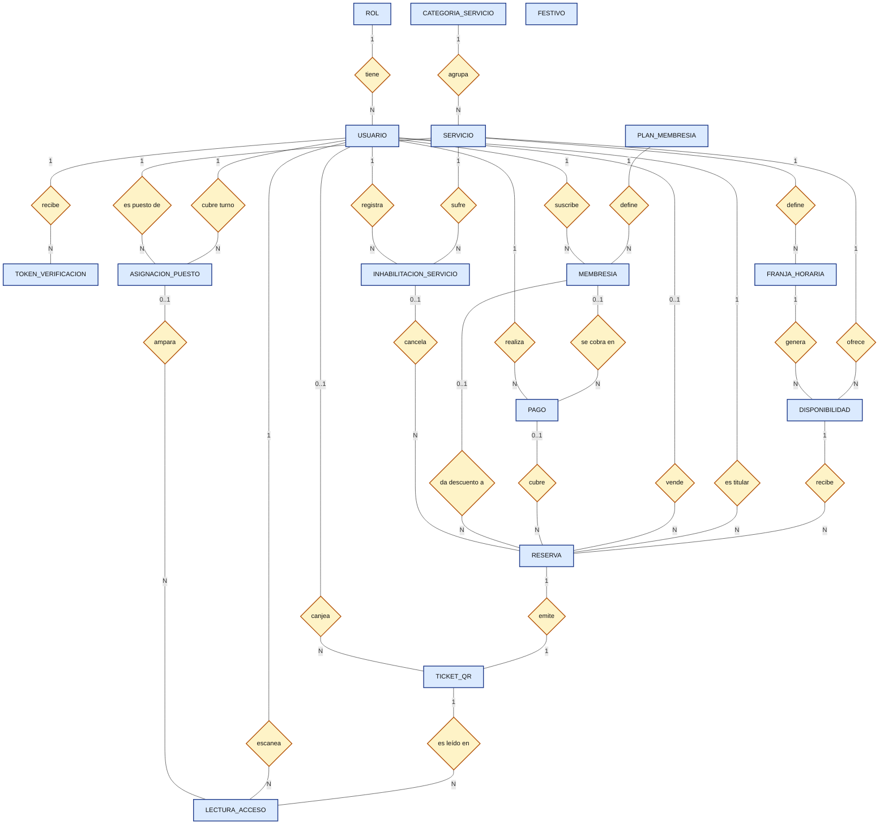
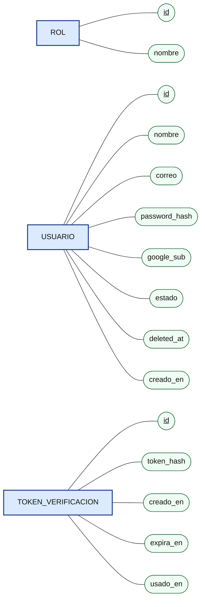
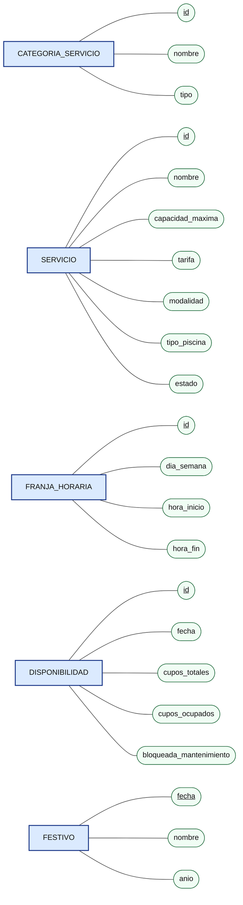
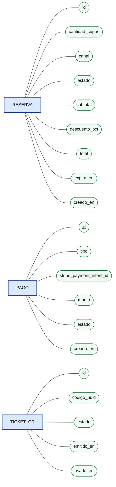
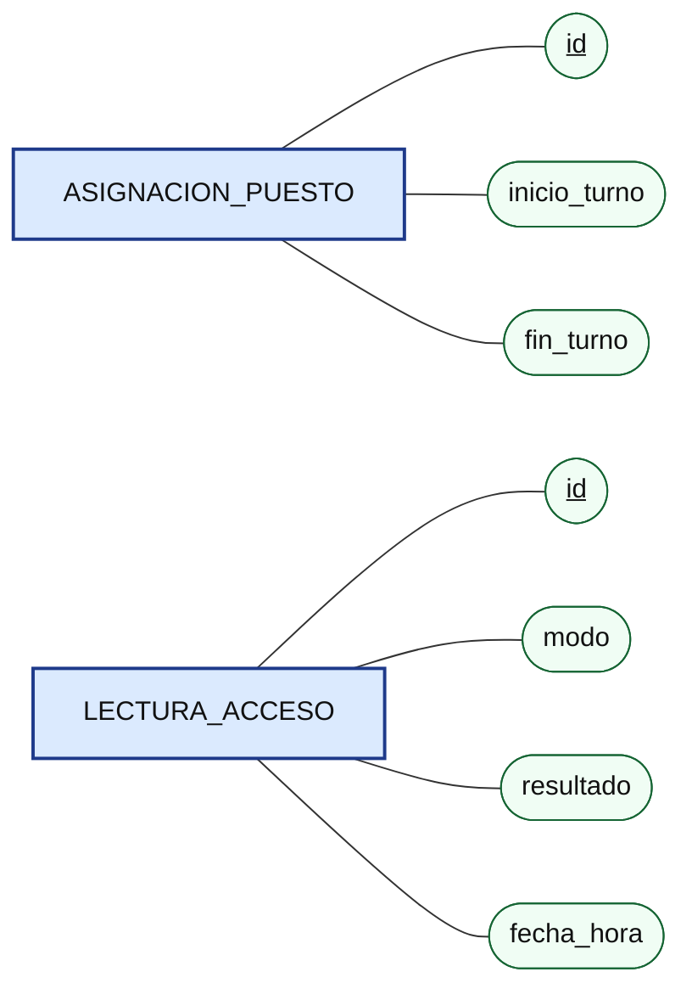
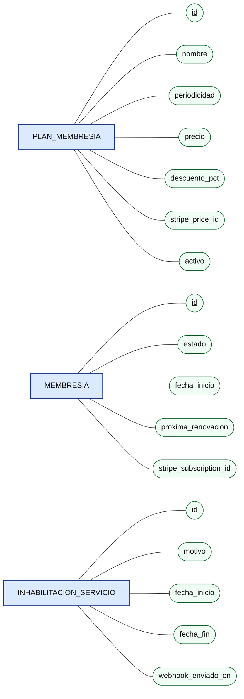

# MER y DER — SportComplex

Modelo derivado del SRS v1.2.0 (RF-00 a RF-21, RNF-01 a RNF-06, RN-01 a RN-14). Motor relacional (p. ej. PostgreSQL), zona horaria `America/Bogota`.

**Notación de Chen:** rectángulo = entidad · rombo = relación · óvalo = atributo (subrayado = llave primaria) · la cardinalidad se escribe sobre cada línea. Siguiendo la notación clásica, las llaves foráneas **no** se dibujan como atributos: quedan expresadas por las relaciones y aparecen en las tablas del DER (sección 4).

---

## 1. MER — Diagrama general de entidades y relaciones (Chen)

> `FESTIVO` es una entidad de consulta (caché de Nager.Date, PT-01): no tiene FK; el sistema la usa por fecha para decidir el mantenimiento de piscinas al generar `DISPONIBILIDAD`.

---

## 2. MER — Atributos por módulo (Chen)

### 2.1 Autenticación y usuarios

### 2.2 Catálogo y disponibilidad

### 2.3 Reservas, pagos y tickets

### 2.4 Control de acceso

### 2.5 Membresías y contingencias

---

## 3. Relaciones y cardinalidades

| # | Relación | Entidad A | Card. A | Card. B | Entidad B | Nota / origen SRS |
| --- | --- | --- | --- | --- | --- | --- |
| 1 | tiene | ROL | 1 | N | USUARIO | §5, RF-18 |
| 2 | recibe | USUARIO | 1 | N | TOKEN_VERIFICACION | RF-02; reenvíos crean nuevos tokens |
| 3 | agrupa | CATEGORIA_SERVICIO | 1 | N | SERVICIO | RF-03 |
| 4 | define | SERVICIO | 1 | N | FRANJA_HORARIA | RF-04 |
| 5 | ofrece | SERVICIO | 1 | N | DISPONIBILIDAD | Calendario propio por servicio |
| 6 | genera | FRANJA_HORARIA | 1 | N | DISPONIBILIDAD | Una fila por fecha |
| 7 | recibe | DISPONIBILIDAD | 1 | N | RESERVA | Varias reservas hasta agotar aforo |
| 8 | es titular | USUARIO | 1 | N | RESERVA | RN-07 multirreserva |
| 9 | vende | USUARIO | 0..1 | N | RESERVA | Solo ventas en taquilla (RF-17) |
| 10 | cubre | PAGO | 0..1 | N | RESERVA | Un pago puede cubrir varias reservas |
| 11 | emite | RESERVA | 1 | 1 | TICKET_QR | RF-10 |
| 12 | canjea | USUARIO | 0..1 | N | TICKET_QR | Lector que da acceso (RF-13) |
| 13 | cubre turno | USUARIO | 1 | N | ASIGNACION_PUESTO | Empleado lector |
| 14 | es puesto de | SERVICIO | 1 | N | ASIGNACION_PUESTO | RF-13 |
| 15 | es leído en | TICKET_QR | 1 | N | LECTURA_ACCESO | Consultas, denegaciones y canje |
| 16 | escanea | USUARIO | 1 | N | LECTURA_ACCESO |  |
| 17 | ampara | ASIGNACION_PUESTO | 0..1 | N | LECTURA_ACCESO | Nulo en modo consulta |
| 18 | define | PLAN_MEMBRESIA | 1 | N | MEMBRESIA | RF-16 |
| 19 | suscribe | USUARIO | 1 | N | MEMBRESIA | Solo una VIGENTE a la vez |
| 20 | se cobra en | MEMBRESIA | 0..1 | N | PAGO | Cada renovación es un pago (RN-09) |
| 21 | da descuento a | MEMBRESIA | 0..1 | N | RESERVA | 30 % (RN-08) |
| 22 | realiza | USUARIO | 1 | N | PAGO |  |
| 23 | sufre | SERVICIO | 1 | N | INHABILITACION_SERVICIO | RF-19 |
| 24 | registra | USUARIO (admin) | 1 | N | INHABILITACION_SERVICIO |  |
| 25 | cancela | INHABILITACION_SERVICIO | 0..1 | N | RESERVA | `CANCELADA_ADMINISTRATIVA` (RN-12) |

---

## 4. DER — Modelo relacional en tablas

Convenciones: **PK** llave primaria · **FK** llave foránea · **UK** única · **NN** no nulo.

### ROL

| Columna | Tipo | Clave | Descripción |
| --- | --- | --- | --- |
| id | int | PK | Identificador |
| nombre | varchar(30) | UK, NN | ADMIN, VENDEDOR, LECTOR, CLIENTE |

### USUARIO

| Columna | Tipo | Clave | Descripción |
| --- | --- | --- | --- |
| id | uuid | PK |  |
| rol_id | int | FK → ROL, NN |  |
| avatar | VarChar(2048) |NN| Urls de la imagenes para el avatar del usuario |
| nombre | varchar(120) | NN |  |
| correo | varchar(150) | UK, NN |  |
| password_hash | varchar(255) |  | Argon2id/BCrypt; nulo si ingresa con Google |
| google_sub | varchar(100) | UK | Nulo si registro por correo |
| estado | varchar(20) | NN | PENDIENTE, ACTIVO, TEMP_INACTIVO, INACTIVO |
| deleted_at | timestamptz |  | Borrado lógico (RN-10) |
| creado_en | timestamptz | NN |  |

### TOKEN_VERIFICACION

| Columna | Tipo | Clave | Descripción |
| --- | --- | --- | --- |
| id | uuid | PK |  |
| usuario_id | uuid | FK → USUARIO, NN |  |
| token_hash | varchar(255) | UK, NN | Nunca se guarda el token en claro |
| creado_en | timestamptz | NN | Base del rate limit de 60 s |
| expira_en | timestamptz | NN | creado_en + 15 min |
| usado_en | timestamptz |  |  |

### CATEGORIA_SERVICIO

| Columna | Tipo | Clave | Descripción |
| --- | --- | --- | --- |
| id | int | PK |  |
| nombre | varchar(60) | UK, NN |  |
| tipo | varchar(20) | NN | CANCHA, PISCINA, GIMNASIO, ZONA_HUMEDA |

### SERVICIO

| Columna | Tipo | Clave | Descripción |
| --- | --- | --- | --- |
| id | int | PK |  |
| categoria_id | int | FK → CATEGORIA_SERVICIO, NN |  |
| nombre | varchar(80) | UK, NN | Ej. "Cancha Sintética 1" |
| capacidad_maxima | int | NN | CHECK > 0 |
| tarifa | numeric(12,2) | NN | Por franja o cupo |
| modalidad | varchar(15) | NN | EXCLUSIVA (cancha, piscina privada) o AFORO |
| tipo_piscina | varchar(10) |  | PUBLICA, PRIVADA; nulo si no es piscina |
| estado | varchar(15) | NN | ACTIVO, INHABILITADO |

### FRANJA_HORARIA

| Columna | Tipo | Clave | Descripción |
| --- | --- | --- | --- |
| id | int | PK |  |
| servicio_id | int | FK → SERVICIO, NN |  |
| dia_semana | smallint | NN | 1 (lunes) a 7 (domingo) |
| hora_inicio | time | NN |  |
| hora_fin | time | NN | CHECK hora_fin > hora_inicio |

### DISPONIBILIDAD

| Columna | Tipo | Clave | Descripción |
| --- | --- | --- | --- |
| id | bigint | PK | Fila que se bloquea con `SELECT ... FOR UPDATE` |
| servicio_id | int | FK → SERVICIO, NN |  |
| franja_id | int | FK → FRANJA_HORARIA, NN |  |
| fecha | date | NN | UNIQUE (servicio_id, franja_id, fecha) |
| cupos_totales | int | NN | 1 si es exclusiva; aforo si es pública |
| cupos_ocupados | int | NN | CHECK entre 0 y cupos_totales |
| bloqueada_mantenimiento | boolean | NN | Lunes de piscina o martes si el lunes es festivo |

### FESTIVO

| Columna | Tipo | Clave | Descripción |
| --- | --- | --- | --- |
| fecha | date | PK | Festivo oficial de Colombia |
| nombre | varchar(100) | NN |  |
| anio | smallint | NN | Sincronización anual con Nager.Date |

### PAGO

| Columna | Tipo | Clave | Descripción |
| --- | --- | --- | --- |
| id | uuid | PK |  |
| usuario_id | uuid | FK → USUARIO, NN | Quien paga |
| membresia_id | int | FK → MEMBRESIA | Solo si es cobro de membresía |
| tipo | varchar(15) | NN | RESERVA, MEMBRESIA |
| stripe_payment_intent_id | varchar(100) | UK, NN | Idempotencia del webhook |
| monto | numeric(12,2) | NN |  |
| estado | varchar(15) | NN | PENDIENTE, APROBADO, FALLIDO |
| creado_en | timestamptz | NN |  |

### RESERVA

| Columna | Tipo | Clave | Descripción |
| --- | --- | --- | --- |
| id | uuid | PK |  |
| disponibilidad_id | bigint | FK → DISPONIBILIDAD, NN |  |
| titular_id | uuid | FK → USUARIO, NN |  |
| vendedor_id | uuid | FK → USUARIO | Nulo si es online |
| pago_id | uuid | FK → PAGO | Nulo hasta que se paga |
| membresia_id | int | FK → MEMBRESIA | Si aplicó 30 % |
| inhabilitacion_id | int | FK → INHABILITACION_SERVICIO | Si se canceló por contingencia |
| cantidad_cupos | int | NN | CHECK > 0 |
| canal | varchar(10) | NN | ONLINE, TAQUILLA |
| estado | varchar(25) | NN | PENDIENTE_PAGO, CONFIRMADA, EXPIRADA, CANCELADA_ADMINISTRATIVA |
| subtotal | numeric(12,2) | NN |  |
| descuento_pct | numeric(5,2) | NN | 0 o 30 |
| total | numeric(12,2) | NN |  |
| expira_en | timestamptz |  | Bloqueo TTL de 30 min (solo PENDIENTE_PAGO) |
| creado_en | timestamptz | NN |  |

### TICKET_QR

| Columna | Tipo | Clave | Descripción |
| --- | --- | --- | --- |
| id | uuid | PK |  |
| reserva_id | uuid | FK → RESERVA, UK, NN | Relación 1:1 |
| codigo_uuid | uuid | UK, NN | Contenido del QR (UUIDv4) |
| usado_por | uuid | FK → USUARIO | Empleado lector que dio acceso |
| estado | varchar(10) | NN | EMITIDO, USADO (irreversible) |
| emitido_en | timestamptz | NN |  |
| usado_en | timestamptz |  |  |

### ASIGNACION_PUESTO

| Columna | Tipo | Clave | Descripción |
| --- | --- | --- | --- |
| id | int | PK |  |
| empleado_id | uuid | FK → USUARIO, NN | Rol LECTOR |
| servicio_id | int | FK → SERVICIO, NN | Puesto que cubre |
| inicio_turno | timestamptz | NN |  |
| fin_turno | timestamptz | NN |  |

### LECTURA_ACCESO

| Columna | Tipo | Clave | Descripción |
| --- | --- | --- | --- |
| id | bigint | PK |  |
| ticket_id | uuid | FK → TICKET_QR, NN |  |
| empleado_id | uuid | FK → USUARIO, NN |  |
| asignacion_id | int | FK → ASIGNACION_PUESTO | Nulo en modo consulta |
| modo | varchar(10) | NN | TURNO, CONSULTA |
| resultado | varchar(20) | NN | CONCEDIDO, DENEGADO_SERVICIO, DENEGADO_HORARIO, DENEGADO_USADO, CONSULTA |
| fecha_hora | timestamptz | NN |  |

### PLAN_MEMBRESIA

| Columna | Tipo | Clave | Descripción |
| --- | --- | --- | --- |
| id | int | PK |  |
| nombre | varchar(60) | NN |  |
| periodicidad | varchar(10) | NN | SEMANAL, MENSUAL, ANUAL |
| precio | numeric(12,2) | NN |  |
| descuento_pct | numeric(5,2) | NN | 30 por defecto |
| stripe_price_id | varchar(100) | UK | Precio recurrente en Stripe |
| activo | boolean | NN |  |

### MEMBRESIA

| Columna | Tipo | Clave | Descripción |
| --- | --- | --- | --- |
| id | int | PK |  |
| usuario_id | uuid | FK → USUARIO, NN |  |
| plan_id | int | FK → PLAN_MEMBRESIA, NN |  |
| estado | varchar(10) | NN | VIGENTE, VENCIDA, CANCELADA |
| fecha_inicio | date | NN |  |
| proxima_renovacion | date | NN |  |
| stripe_subscription_id | varchar(100) | UK |  |

### INHABILITACION_SERVICIO

| Columna | Tipo | Clave | Descripción |
| --- | --- | --- | --- |
| id | int | PK |  |
| servicio_id | int | FK → SERVICIO, NN |  |
| admin_id | uuid | FK → USUARIO, NN |  |
| motivo | varchar(255) | NN | Fuerza mayor |
| fecha_inicio | timestamptz | NN |  |
| fecha_fin | timestamptz |  | Nulo si sigue vigente |
| webhook_enviado_en | timestamptz |  | Disparo al placeholder de n8n |

---

## 5. Restricciones que garantizan las reglas críticas

| Regla | Mecanismo en BD |
| --- | --- |
| Sin overbooking (RNF-01) | `UNIQUE (servicio_id, franja_id, fecha)` en DISPONIBILIDAD; `CHECK (cupos_ocupados BETWEEN 0 AND cupos_totales)`; `SELECT ... FOR UPDATE` al reservar |
| Ventana 15 días / no pasado (RN-01, RN-11) | Validación transaccional al crear DISPONIBILIDAD/RESERVA (`fecha BETWEEN hoy AND hoy + 15`, hora `America/Bogota`) |
| Bloqueo TTL 30 min (RN-04, revisado en TSK-BE-09) | `RESERVA.expira_en` + job que pasa `PENDIENTE_PAGO` vencidas a `EXPIRADA` y libera cupos; índice parcial `WHERE estado = 'PENDIENTE_PAGO'` |
| Ticket de uso único (RN-05) | `UNIQUE (reserva_id)`, `UNIQUE (codigo_uuid)`; `UPDATE ... WHERE estado = 'EMITIDO'` |
| Validación servicio/horario en puerta | TICKET → RESERVA → DISPONIBILIDAD → SERVICIO comparado con `ASIGNACION_PUESTO.servicio_id` y la franja |
| Borrado lógico (RN-10) | `USUARIO.deleted_at` / `estado = INACTIVO`; sin `DELETE`; FKs `ON DELETE RESTRICT` |
| Una sola membresía vigente | Índice único parcial `(usuario_id) WHERE estado = 'VIGENTE'` |
| Pago idempotente (webhook) | `UNIQUE (stripe_payment_intent_id)` |
| Cashless (RN-13) | No existe entidad de caja ni pago en efectivo |

**Índices sugeridos:** `DISPONIBILIDAD(fecha, servicio_id)`, `RESERVA(titular_id, estado)`, `RESERVA(expira_en) WHERE estado = 'PENDIENTE_PAGO'`, `LECTURA_ACCESO(fecha_hora)` (analítica RF-21).
