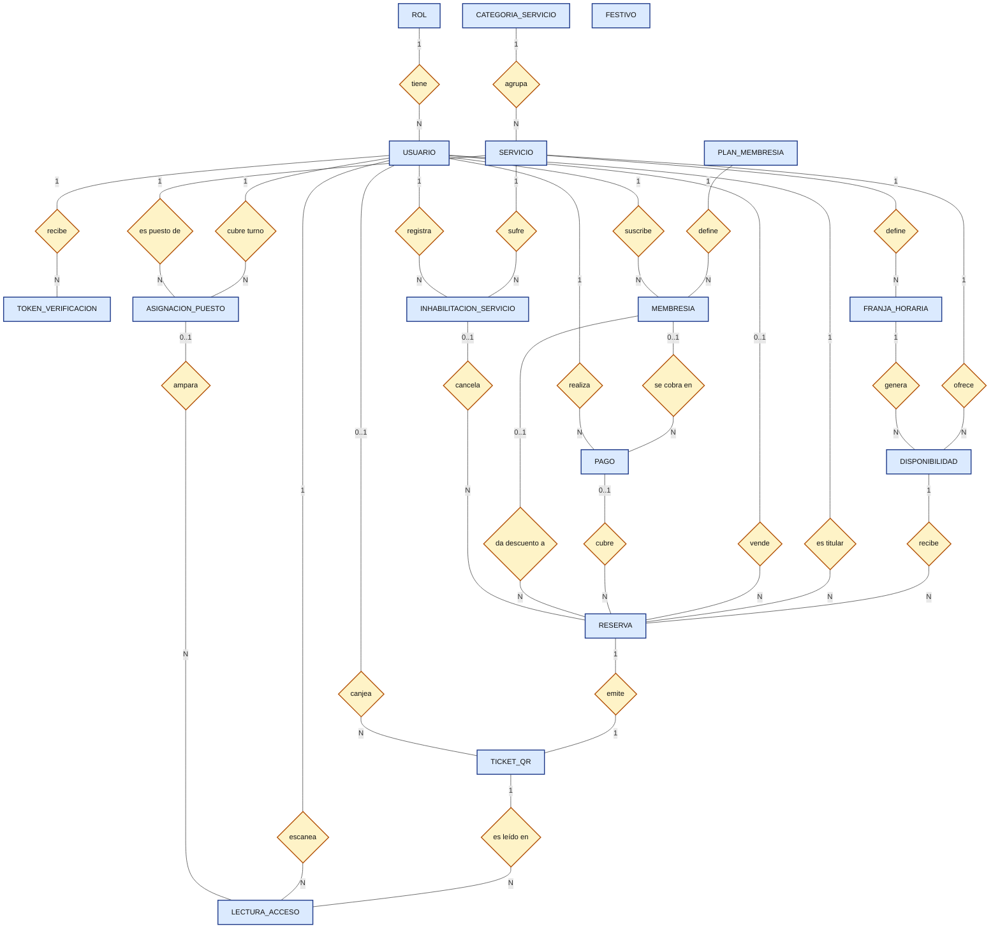

# MER y DER — SportComplex

Modelo derivado del SRS v1.2.0 (RF-00 a RF-21, RNF-01 a RNF-06, RN-01 a RN-14). Motor relacional PostgreSQL, zona horaria `America/Bogota`.

**Notación de Chen:** rectángulo = entidad · rombo = relación · óvalo = atributo (subrayado = llave primaria) · la cardinalidad se escribe sobre cada línea. Siguiendo la notación clásica, las llaves foráneas **no** se dibujan como atributos: quedan expresadas por las relaciones y aparecen en las tablas del DER (sección 4).

---

## 1. MER — Diagrama general de entidades y relaciones (Chen)



---

## 2. Enums de Dominio PostgreSQL

* **EstadoUsuario:** `PENDIENTE`, `ACTIVO`, `TEMP_INACTIVO`, `INACTIVO`
* **TipoCategoriaServicio:** `CANCHA`, `PISCINA`, `GIMNASIO`, `ZONA_HUMEDA`
* **ModalidadServicio:** `EXCLUSIVA`, `AFORO`
* **TipoPiscina:** `PUBLICA`, `PRIVADA`
* **EstadoServicio:** `ACTIVO`, `INHABILITADO`
* **TipoPago:** `RESERVA`, `MEMBRESIA`
* **EstadoPago:** `PENDIENTE`, `APROBADO`, `FALLIDO`
* **CanalReserva:** `ONLINE`, `TAQUILLA`
* **EstadoReserva:** `PENDIENTE_PAGO`, `CONFIRMADA`, `EXPIRADA`, `CANCELADA_ADMINISTRATIVA`
* **EstadoTicket:** `EMITIDO`, `USADO`
* **ModoLectura:** `TURNO`, `CONSULTA`
* **ResultadoLectura:** `CONCEDIDO`, `DENEGADO_SERVICIO`, `DENEGADO_HORARIO`, `DENEGADO_USADO`, `CONSULTA`
* **PeriodicidadPlan:** `SEMANAL`, `MENSUAL`, `ANUAL`
* **EstadoMembresia:** `VIGENTE`, `VENCIDA`, `CANCELADA`

---

## 3. Relaciones y Cardinalidades

| # | Relación | Entidad A | Card. A | Card. B | Entidad B | Nota / origen SRS |
| --- | --- | --- | --- | --- | --- | --- |
| 1 | tiene | ROL | 1 | N | USUARIO | §5, RF-18 |
| 2 | recibe | USUARIO | 1 | N | TOKEN_VERIFICACION | RF-02; reenvíos crean nuevos tokens (ON DELETE CASCADE) |
| 3 | agrupa | CATEGORIA_SERVICIO | 1 | N | SERVICIO | RF-03 |
| 4 | define | SERVICIO | 1 | N | FRANJA_HORARIA | RF-04 (ON DELETE CASCADE) |
| 5 | ofrece | SERVICIO | 1 | N | DISPONIBILIDAD | Calendario propio por servicio |
| 6 | genera | FRANJA_HORARIA | 1 | N | DISPONIBILIDAD | Una fila por fecha |
| 7 | recibe | DISPONIBILIDAD | 1 | N | RESERVA | Varias reservas hasta agotar aforo |
| 8 | es titular | USUARIO | 1 | N | RESERVA | RN-07 multirreserva |
| 9 | vende | USUARIO | 0..1 | N | RESERVA | Solo ventas en taquilla (RF-17) |
| 10 | cubre | PAGO | 0..1 | N | RESERVA | Un pago puede cubrir varias reservas (ON DELETE SET NULL) |
| 11 | emite | RESERVA | 1 | 1 | TICKET_QR | RF-10 |
| 12 | canjea | USUARIO | 0..1 | N | TICKET_QR | Lector que da acceso (RF-13) |
| 13 | cubre turno | USUARIO | 1 | N | ASIGNACION_PUESTO | Empleado lector |
| 14 | es puesto de | SERVICIO | 1 | N | ASIGNACION_PUESTO | RF-13 |
| 15 | es leído en | TICKET_QR | 1 | N | LECTURA_ACCESO | Consultas, denegaciones y canje |
| 16 | escanea | USUARIO | 1 | N | LECTURA_ACCESO |  |
| 17 | ampara | ASIGNACION_PUESTO | 0..1 | N | LECTURA_ACCESO | Nulo en modo consulta (ON DELETE SET NULL) |
| 18 | define | PLAN_MEMBRESIA | 1 | N | MEMBRESIA | RF-16 |
| 19 | suscribe | USUARIO | 1 | N | MEMBRESIA | Solo una VIGENTE a la vez |
| 20 | se cobra en | MEMBRESIA | 0..1 | N | PAGO | Cada renovación es un pago (ON DELETE SET NULL) |
| 21 | da descuento a | MEMBRESIA | 0..1 | N | RESERVA | 30 % (RN-08) (ON DELETE SET NULL) |
| 22 | realiza | USUARIO | 1 | N | PAGO | Audita el usuario pagador |
| 23 | sufre | SERVICIO | 1 | N | INHABILITACION_SERVICIO | RF-19 |
| 24 | registra | USUARIO (admin) | 1 | N | INHABILITACION_SERVICIO |  |
| 25 | cancela | INHABILITACION_SERVICIO | 0..1 | N | RESERVA | `CANCELADA_ADMINISTRATIVA` (RN-12) (ON DELETE SET NULL) |

---

## 4. DER — Modelo relacional en tablas (`schema.prisma`)

### 1. ROL (`rol`)

| Columna | Tipo | Clave / Restricción | Descripción |
| --- | --- | --- | --- |
| id | Int | PK, Autoincrement | Identificador primario |
| nombre | VarChar(30) | UNIQUE, NN | ADMIN, VENDEDOR, LECTOR, CLIENTE |

### 2. USUARIO (`usuario`)

| Columna | Tipo | Clave / Restricción | Descripción |
| --- | --- | --- | --- |
| id | Uuid | PK, Default(uuid()) | Identificador único |
| rol_id | Int | FK → `rol.id`, NN | Restrict |
| nombre | VarChar(120) | NN | Nombre completo |
| correo | VarChar(150) | UNIQUE, NN | Correo electrónico |
| password_hash | VarChar(255) | Nullable | Nulo si el registro es por Google |
| google_sub | VarChar(100) | UNIQUE, Nullable | Sub / ID de Google OAuth |
| estado | EstadoUsuario | Default(PENDIENTE), NN | Enum de estado |
| deleted_at | Timestamptz | Nullable | Borrado lógico (RN-10) |
| creado_en | Timestamptz | Default(now()), NN | Fecha de registro |

### 3. TOKEN_VERIFICACION (`token_verificacion`)

| Columna | Tipo | Clave / Restricción | Descripción |
| --- | --- | --- | --- |
| id | Uuid | PK, Default(uuid()) | Identificador único |
| usuario_id | Uuid | FK → `usuario.id`, NN | Cascade |
| token_hash | VarChar(255) | UNIQUE, NN | Hash del token de verificación |
| creado_en | Timestamptz | Default(now()), NN |  |
| expira_en | Timestamptz | NN | Fecha/Hora límite |
| usado_en | Timestamptz | Nullable | Timestamp de canje |

### 4. CATEGORIA_SERVICIO (`categoria_servicio`)

| Columna | Tipo | Clave / Restricción | Descripción |
| --- | --- | --- | --- |
| id | Int | PK, Autoincrement |  |
| nombre | VarChar(60) | UNIQUE, NN | Nombre de categoría |
| tipo | TipoCategoriaServicio | NN | Enum de tipo |

### 5. SERVICIO (`servicio`)

| Columna | Tipo | Clave / Restricción | Descripción |
| --- | --- | --- | --- |
| id | Int | PK, Autoincrement |  |
| categoria_id | Int | FK → `categoria_servicio.id`, NN | Restrict |
| nombre | VarChar(80) | UNIQUE, NN | Nombre comercial |
| capacidad_maxima | Int | NN | Capacidad de aforo |
| tarifa | Decimal(12,2) | NN | Tarifa base |
| modalidad | ModalidadServicio | NN | EXCLUSIVA / AFORO |
| tipo_piscina | TipoPiscina | Nullable | PUBLICA / PRIVADA |
| estado | EstadoServicio | Default(ACTIVO), NN | ACTIVO / INHABILITADO |

### 6. FRANJA_HORARIA (`franja_horaria`)

| Columna | Tipo | Clave / Restricción | Descripción |
| --- | --- | --- | --- |
| id | Int | PK, Autoincrement |  |
| servicio_id | Int | FK → `servicio.id`, NN | Cascade |
| dia_semana | SmallInt | NN | 1 a 7 (Lunes a Domingo) |
| hora_inicio | Time | NN | Hora de apertura del bloque |
| hora_fin | Time | NN | Hora de cierre del bloque |

### 7. DISPONIBILIDAD (`disponibilidad`)

| Columna | Tipo | Clave / Restricción | Descripción |
| --- | --- | --- | --- |
| id | BigInt | PK, Autoincrement |  |
| servicio_id | Int | FK → `servicio.id`, NN | Restrict |
| franja_id | Int | FK → `franja_horaria.id`, NN | Restrict |
| fecha | Date | NN | Fecha específica |
| cupos_totales | Int | NN | Aforo configurado |
| cupos_ocupados | Int | Default(0), NN | Cupos reservados |
| bloqueada_mantenimiento | Boolean | Default(false), NN |  |
| **Índices** | - | **UNIQUE (servicio_id, franja_id, fecha)**<br>

<br>**INDEX (fecha, servicio_id)** | Optimización de agenda |

### 8. FESTIVO (`festivo`)

| Columna | Tipo | Clave / Restricción | Descripción |
| --- | --- | --- | --- |
| fecha | Date | PK | Fecha festiva |
| nombre | VarChar(100) | NN | Descripción del festivo |
| anio | SmallInt | NN | Año correspondiente |

### 9. PAGO (`pago`)

| Columna | Tipo | Clave / Restricción | Descripción |
| --- | --- | --- | --- |
| id | Uuid | PK, Default(uuid()) |  |
| usuario_id | Uuid | FK → `usuario.id`, NN | Restrict |
| membresia_id | Int | FK → `membresia.id`, Nullable | SetNull |
| tipo | TipoPago | NN | RESERVA / MEMBRESIA |
| stripe_payment_intent_id | VarChar(100) | UNIQUE, NN | Identificador de Stripe |
| monto | Decimal(12,2) | NN | Monto procesado |
| estado | EstadoPago | NN | PENDIENTE / APROBADO / FALLIDO |
| creado_en | Timestamptz | Default(now()), NN |  |

### 10. RESERVA (`reserva`)

| Columna | Tipo | Clave / Restricción | Descripción |
| --- | --- | --- | --- |
| id | Uuid | PK, Default(uuid()) |  |
| disponibilidad_id | BigInt | FK → `disponibilidad.id`, NN | Restrict |
| titular_id | Uuid | FK → `usuario.id`, NN | Restrict |
| vendedor_id | Uuid | FK → `usuario.id`, Nullable | Restrict (Venta en taquilla) |
| pago_id | Uuid | FK → `pago.id`, Nullable | SetNull |
| membresia_id | Int | FK → `membresia.id`, Nullable | SetNull |
| inhabilitacion_id | Int | FK → `inhabilitacion_servicio.id`, Nullable | SetNull |
| cantidad_cupos | Int | NN | Cantidad de entradas |
| canal | CanalReserva | NN | ONLINE / TAQUILLA |
| estado | EstadoReserva | NN | Estado de flujo de la reserva |
| subtotal | Decimal(12,2) | NN | Monto bruto |
| descuento_pct | Decimal(5,2) | Default(0.00), NN | Porcentaje de descuento aplicado |
| total | Decimal(12,2) | NN | Monto a pagar |
| expira_en | Timestamptz | Nullable | TTL de pago de reserva |
| creado_en | Timestamptz | Default(now()), NN |  |
| **Índices** | - | **INDEX (titular_id, estado)**<br>

<br>**INDEX (expira_en)** | Optimización de búsquedas y limpieza |

### 11. TICKET_QR (`ticket_qr`)

| Columna | Tipo | Clave / Restricción | Descripción |
| --- | --- | --- | --- |
| id | Uuid | PK, Default(uuid()) |  |
| reserva_id | Uuid | FK → `reserva.id`, UNIQUE, NN | Restrict (Relación 1:1) |
| codigo_uuid | Uuid | UNIQUE, Default(uuid()), NN | Código para generación de QR |
| usado_por | Uuid | FK → `usuario.id`, Nullable | Restrict (Lector que procesó el ingreso) |
| estado | EstadoTicket | NN | EMITIDO / USADO |
| emitido_en | Timestamptz | Default(now()), NN |  |
| usado_en | Timestamptz | Nullable | Fecha/Hora de escaneo |

### 12. ASIGNACION_PUESTO (`asignacion_puesto`)

| Columna | Tipo | Clave / Restricción | Descripción |
| --- | --- | --- | --- |
| id | Int | PK, Autoincrement |  |
| empleado_id | Uuid | FK → `usuario.id`, NN | Restrict |
| servicio_id | Int | FK → `servicio.id`, NN | Restrict |
| inicio_turno | Timestamptz | NN |  |
| fin_turno | Timestamptz | NN |  |

### 13. LECTURA_ACCESO (`lectura_acceso`)

| Columna | Tipo | Clave / Restricción | Descripción |
| --- | --- | --- | --- |
| id | BigInt | PK, Autoincrement |  |
| ticket_id | Uuid | FK → `ticket_qr.id`, NN | Restrict |
| empleado_id | Uuid | FK → `usuario.id`, NN | Restrict |
| asignacion_id | Int | FK → `asignacion_puesto.id`, Nullable | SetNull |
| modo | ModoLectura | NN | TURNO / CONSULTA |
| resultado | ResultadoLectura | NN | Resultado de la validación |
| fecha_hora | Timestamptz | Default(now()), NN |  |
| **Índices** | - | **INDEX (fecha_hora)** | Auditoría de accesos |

### 14. PLAN_MEMBRESIA (`plan_membresia`)

| Columna | Tipo | Clave / Restricción | Descripción |
| --- | --- | --- | --- |
| id | Int | PK, Autoincrement |  |
| nombre | VarChar(60) | NN |  |
| periodicidad | PeriodicidadPlan | NN | SEMANAL / MENSUAL / ANUAL |
| precio | Decimal(12,2) | NN |  |
| descuento_pct | Decimal(5,2) | Default(30.00), NN |  |
| stripe_price_id | VarChar(100) | UNIQUE, Nullable | ID del precio en Stripe |
| activo | Boolean | Default(true), NN |  |

### 15. MEMBRESIA (`membresia`)

| Columna | Tipo | Clave / Restricción | Descripción |
| --- | --- | --- | --- |
| id | Int | PK, Autoincrement |  |
| usuario_id | Uuid | FK → `usuario.id`, NN | Restrict |
| plan_id | Int | FK → `plan_membresia.id`, NN | Restrict |
| estado | EstadoMembresia | NN | VIGENTE / VENCIDA / CANCELADA |
| fecha_inicio | Date | NN |  |
| proxima_renovacion | Date | NN |  |
| stripe_subscription_id | VarChar(100) | UNIQUE, Nullable | ID de suscripción en Stripe |

### 16. INHABILITACION_SERVICIO (`inhabilitacion_servicio`)

| Columna | Tipo | Clave / Restricción | Descripción |
| --- | --- | --- | --- |
| id | Int | PK, Autoincrement |  |
| servicio_id | Int | FK → `servicio.id`, NN | Restrict |
| admin_id | Uuid | FK → `usuario.id`, NN | Restrict |
| motivo | VarChar(255) | NN | Razón de inhabilitación |
| fecha_inicio | Timestamptz | NN |  |
| fecha_fin | Timestamptz | Nullable | Indefinido si es nulo |
| webhook_enviado_en | Timestamptz | Nullable | Registro de notificación |

---

## 5. Datos Iniciales Cargados en Fábrica (`seed.ts`)

1. **Roles Nativos (`rol`):**
* `ADMIN`
* `VENDEDOR`
* `LECTOR`
* `CLIENTE`


2. **Planes de Membresía (`plan_membresia`):**
* **Plan Semanal Básico:** Periodicidad `SEMANAL`, Precio `$50.00`, Descuento `30.00%`, Activo `true`.
* **Plan Mensual Estándar:** Periodicidad `MENSUAL`, Precio `$180.00`, Descuento `30.00%`, Activo `true`.
* **Plan Anual Premium:** Periodicidad `ANUAL`, Precio `$1800.00`, Descuento `30.00%`, Activo `true`.


```

```