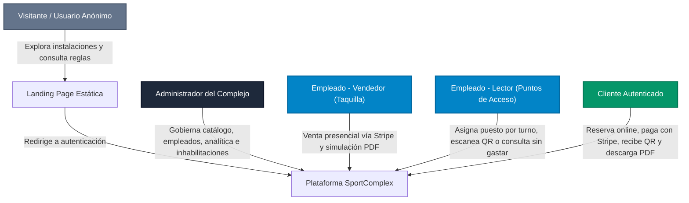
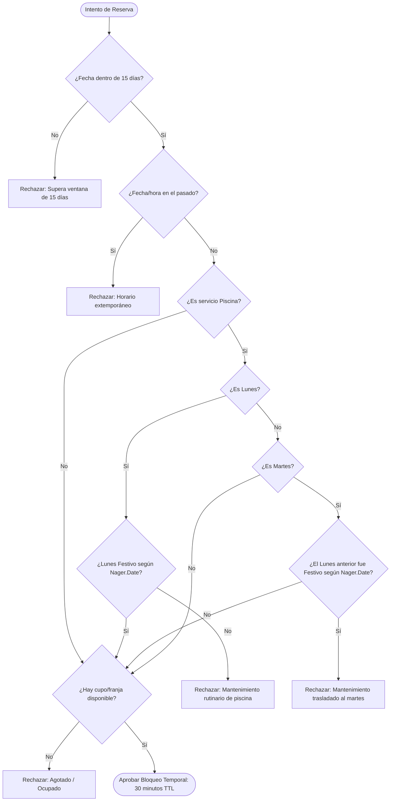
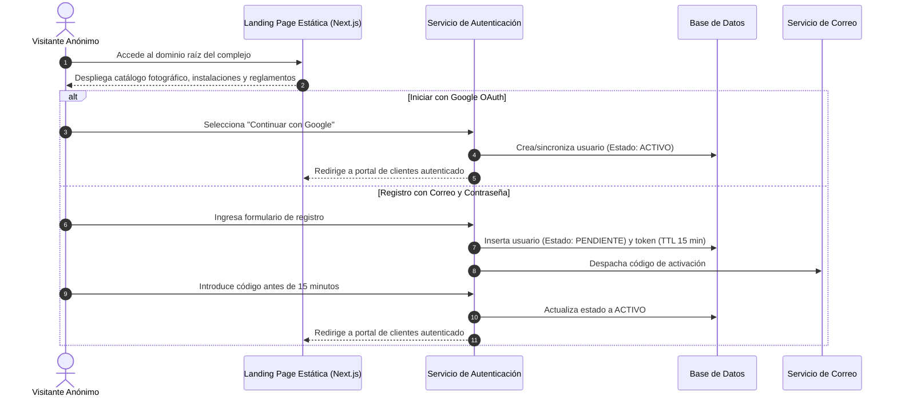
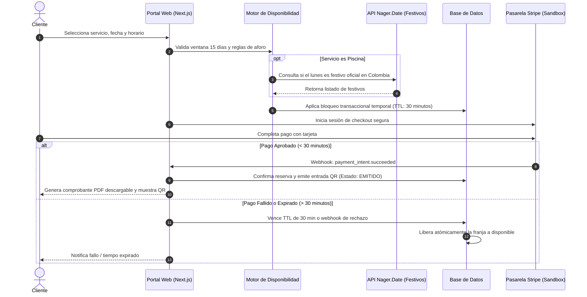
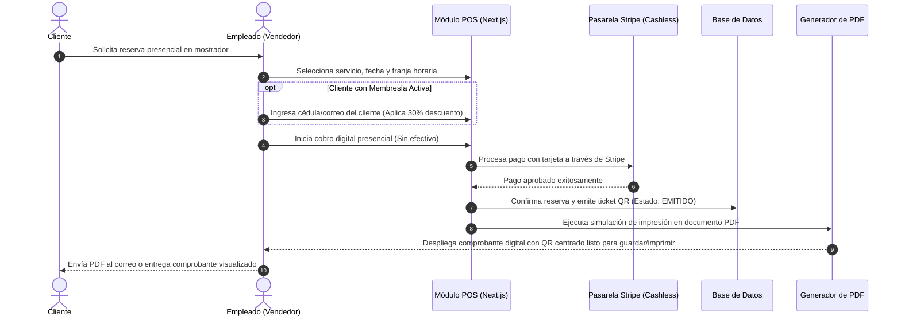
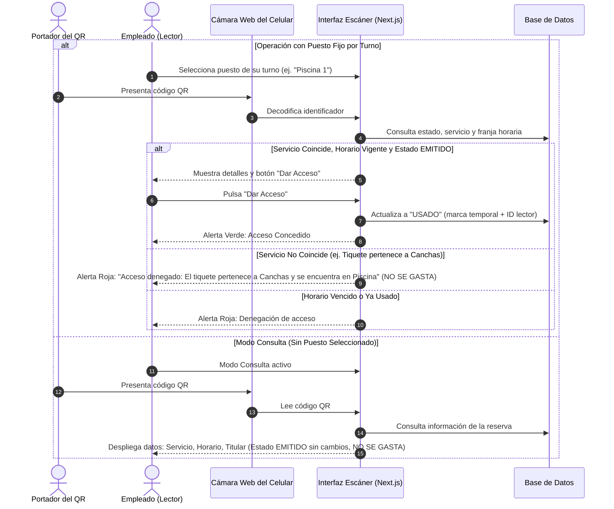
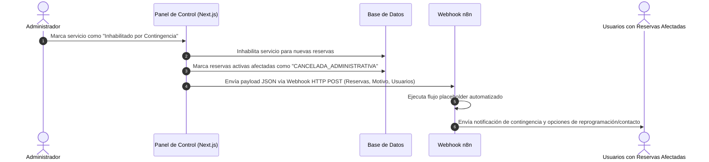

# Especificación de Requisitos de Software (SRS)
## Sistema de Gestión y Control de Acceso para Complejo Deportivo (`SportComplex`)

---

### Control del Documento
* **Proyecto:** Plataforma de Gestión de Reservas, Venta y Control de Acceso Deportivo
* **Versión:** 1.2.0-AUDITED
* **Estado:** Especificación Formal de Requisitos (Revisión Integral y Ajustes de Modelo Cashless / PDF)
* **Fecha:** 29 de Septiembre de 2026
* **Zona Horaria del Sistema:** Colombia (`America/Bogota`, UTC-5)
* **Stack Tecnológico Base:** Next.js (App Router, TypeScript), Base de Datos Relacional, Stripe (Cashless), Nager.Date API, n8n

> [!NOTE]
> **Criterio de Prevalencia y Ajustes Recientes:**  
> En orden cronológico, los requerimientos detallados priman sobre el *Gist* inicial. En la presente revisión se incorporan definiciones críticas de arquitectura:
> 1. **Modelo 100% Cashless:** Toda transacción monetaria (en línea y en taquilla presencial) se procesa exclusivamente vía **Stripe**. Queda totalmente eliminado el manejo de dinero en efectivo.
> 2. **Simulación de Impresión en PDF:** Se prescinde de impresoras térmicas físicas de punto de venta. La emisión de tiquetes se efectúa mediante generación y simulación de impresión en formato **PDF** digital.
> 3. **Landing Page Estática:** El punto de entrada al dominio principal del complejo es un portal web estático institucional con vitrina de servicios y redirección a login/registro.
> 4. **API de Festivos Nager Holidays:** El cálculo de lunes festivos para la regla de piscinas se integra directamente con la API externa **Nager.Date**.

---

## 1. Resumen Ejecutivo

El presente documento constituye la Especificación de Requisitos de Software (SRS) formal para la plataforma integral **SportComplex**, un sistema web centralizado diseñado para automatizar y administrar la operación comercial, deportiva y de control de accesos de un complejo multideportivo (canchas sintéticas/múltiples, piscinas, gimnasio y zona húmeda con sauna y turco).

El sistema reemplaza los métodos analógicos (llamadas telefónicas, WhatsApp y registros en papel) que provocaban sobreventas (*overbooking*), pérdida de horas hombre en taquilla y vulnerabilidades en la verificación física en puertas.

Construida íntegramente sobre **Next.js** (TypeScript) con persistencia relacional transaccional, la plataforma adopta un modelo operativo **100% Cashless** (cero efectivo) donde todos los pagos se procesan mediante la pasarela **Stripe**. La emisión física de recibos se sustituye por una **simulación de impresión como PDF**, y el acceso principal al sistema se realiza a través de un **sitio web estático / landing page** que presenta la oferta deportiva y guía a los usuarios hacia el registro o inicio de sesión. El control de accesos se resuelve íntegramente desde la cámara de cualquier teléfono móvil del personal con asignación de turnos y modo consulta.

---

## 2. Problema y Objetivo del Producto

### 2.1. Declaración del Problema
* **Overbooking y Gestión Analógica:** La recepción manual de reservas por vía telefónica o chats carece de control de concurrencia, generando dobles reservas simultáneas sobre la misma franja o instalación.
* **Riesgos Operativos por Manejo de Efectivo:** El cobro en efectivo en taquillas físicas genera descuadres de caja, lentitud en la atención y riesgos de seguridad física en el complejo.
* **Dependencia de Hardware Costoso e Ineficiente:** El uso de impresoras térmicas dedicadas y escáneres láser genera fallos mecánicos constantes por atascos de papel, falta de suministros y costos elevados de mantenimiento.
* **Asignación Asimétrica de Aforos:** Dificultad para coordinar servicios de alquiler exclusivo (canchas completas) frente a servicios de aforo compartido y concurrente (piscinas y gimnasio).
* **Control de Acceso Inseguro:** Verificación visual manual propensa a suplantaciones, boletos adulterados o ingresos extemporáneos.

### 2.2. Objetivo del Producto
Desarrollar e implantar una solución web completa, responsiva y de alto rendimiento en Next.js que:
1. Disponga de una **Landing Page institucional estática** como fachada pública que exponga las instalaciones y canalice a los clientes hacia la autenticación y reservas.
2. Automatice el ciclo de vida completo de la reserva bajo un modelo **100% Cashless** procesado a través de **Stripe** (tanto para compras web como para ventas presenciales en taquilla).
3. Asegure la integridad de datos a nivel de base de datos relacional para evitar sobreventas mediante bloqueos transaccionales temporales con TTL de 30 minutos.
4. Soporte la emisión de entradas mediante **códigos QR de uso único** y **simulación de impresión en formato PDF** descargable/imprimible sin requerir hardware térmico dedicado.
5. Provea un módulo de escáner web móvil para empleados con selección de puesto fijo por turno y modo consulta informativo (sin consumir el ticket).
6. Automatice la consulta de días festivos oficiales en Colombia mediante la API **Nager Holidays (nager.date)** para el traslado dinámico del mantenimiento de piscinas.
7. Integre flujos automatizados con **n8n** (placeholder de contingencia y chatbot de atención) y un panel gerencial de analítica.

---

## 3. Alcance

El sistema abarcará los siguientes módulos funcionales y técnicos:
* **Sitio Web Estático Institucional (Landing Page):** Portal de bienvenida público con exhibición de instalaciones, reglamentos y botones de redirección a Login y Registro.
* **Catálogo y Configuración de Espacios:** Creación de categorías e instancias de servicios independientes con calendarios, tarifas y franjas horarias autónomas.
* **Reglas de Negocio de Piscinas con API Nager.Date:** Ventana máxima de 15 días calendario, bloqueo rutinario de mantenimiento los lunes con traslado automático al martes si el lunes es festivo oficial en Colombia (consultado vía Nager.Date API), y modalidad Pública (aforo) vs. Privada (exclusividad).
* **Motor de Reservas con Bloqueo de 15 Minutos:** Bloqueo preventivo temporal durante el checkout con liberación atómica ante expiración o abandono.
* **Venta Presencial POS y Online 100% Cashless vía Stripe:** Procesamiento de cobros exclusivamente con tarjeta mediante Stripe en modo prueba, eliminando el efectivo en todo el complejo.
* **Simulación de Impresión en Formato PDF:** Generación y descarga/impresión virtual de comprobantes con código QR embebido en formato PDF estándar.
* **Multirreserva Concurrente de Servicios:** Habilitación para que un mismo usuario reserve diferentes servicios en el mismo horario.
* **Control de Acceso por Escáner Web Móvil:** Validación de QR desde la cámara del celular con selector de puesto de turno (denegación si no coincide con el servicio) y modo consulta informativo sin consumo de boleto.
* **Membresías Recurrentes Automáticas:** Suscripciones periódicas con renovación programada y 30% de descuento directo en todos los servicios.
* **Gestión de Clientes y Empleados:** Google OAuth (activo inmediato) o registro tradicional (token temporal de 15 min); control de empleados con roles y borrado lógico.
* **Integraciones n8n y Analítica:** Webhook placeholder para inhabilitación por fuerza mayor, chatbot de consultas y panel con indicadores de afluencia, ventas e ingresos.

---

## 4. Fuera de Alcance

Los siguientes elementos quedan formalmente excluidos del proyecto:
1. **Recepción o Custodia de Dinero en Efectivo:** El sistema no dispondrá de módulos de apertura de caja menor, arqueo de billetes ni registro de pagos en efectivo; toda transacción física presencial se canalizará mediante Stripe.
2. **Controladores para Impresoras Térmicas de Hardware:** No se desarrollará soporte para hardware de impresión térmica ni protocolos ESC/POS; la emisión se resuelve mediante simulación a documento PDF.
3. **Reversiones Bancarias Automáticas ante Contingencia:** La inhabilitación administrativa no ejecuta devoluciones directas vía API de Stripe; actúa como placeholder hacia n8n para reprogramaciones o gestión manual.
4. **Cancelaciones Voluntarias por Autoservicio del Cliente:** El usuario no dispone de cancelación o reembolso autónomo desde su panel.
5. **Aplicaciones Móviles Nativas:** No se generarán instalables de tiendas (iOS/Android); toda la solución opera sobre navegadores web modernos.

---

## 5. Stakeholders y Tipos de Usuario

### 5.1. Matriz de Perfiles y Roles de Usuario

| Rol | Denominación | Responsabilidades y Flujos Asignados | Entorno de Interfaz (UI/UX) |
| :--- | :--- | :--- | :--- |
| **Visitante Anónimo** | Usuario General | Acceso inicial al dominio web; visualiza instalaciones, servicios y reglamentos; enlaces a Login y Registro. | Landing page estática moderna, optimizada para SEO, con navegación rápida y responsive. |
| **Administrador** | Gerente General | Gestión de catálogo, aforos, horarios, empleados (borrado lógico), inhabilitación de instalaciones y analítica. | Panel web administrativo de escritorio/tablet con alta densidad de datos y gráficos ejecutivos. |
| **Empleado Vendedor** | Taquillero Cashless | Venta presencial asistida, inicio de checkout con Stripe (cero efectivo) y simulación de impresión de boletos en PDF. | Interfaz POS con botones táctiles grandes, integración con Stripe y diálogo de generación de PDF. |
| **Empleado Lector** | Personal de Control de Acceso | Validación de boletos mediante cámara web móvil. Selecciona puesto de turno (con validación de servicio) o modo consulta sin consumo. | Vista móvil optimizada para cámara web con alertas auditivas y visuales en pantalla completa. |
| **Cliente** | Usuario / Deportista / Socio | Registro (correo o Google OAuth), reserva con bloqueo de 30 min, pago en Stripe, gestión de membresías y descarga de entradas en PDF/QR. | Portal de clientes responsivo con enfoque visual moderno, autogestión de tiquetes y membresías. |

---

## 6. Requisitos Funcionales

### RF-00: Sitio Web Estático Institucional (Landing Page de Entrada)
* **Prioridad:** Must
* **Actor:** Visitante Anónimo, Cliente
* **Descripción:** Al acceder al dominio raíz del complejo deportivo, el sistema debe desplegar un sitio web estático optimizado con la presentación institucional del complejo, catálogo fotográfico de las instalaciones (canchas, piscinas, gimnasio, zona húmeda), horarios generales, reglamentos y botones visibles de redirección hacia "Iniciar Sesión" y "Registrarse".
* **Criterios de Aceptación:**
  * **Dado** que un usuario no autenticado ingresa a la URL raíz del complejo,
  * **Cuando** carga la página principal,
  * **Entonces** visualiza la landing page con la información de las instalaciones y accesos directos al flujo de autenticación sin requerir inicio de sesión previo.
* **Fuente:** Acuerdo de Refinamiento: *"Cuando el cliente entre al dominio del complejo lo primero que verá sera un sitio web estatico donde podra redirigirse al inicio de sesion o registro."*

---

### RF-01: Autenticación de Clientes y Registro Federado con Google OAuth
* **Prioridad:** Must
* **Actor:** Cliente
* **Descripción:** El sistema debe permitir el registro e inicio de sesión de clientes mediante correo electrónico y contraseña (con hashing seguro), o mediante autenticación federada con Google OAuth. Los usuarios que inicien sesión con Google OAuth adquieren el estado `Activo` de inmediato.
* **Criterios de Aceptación:**
  * **Dado** que un usuario accede al portal desde la landing page,
  * **Cuando** selecciona "Continuar con Google" y autoriza sus credenciales,
  * **Entonces** el sistema autentica la sesión y registra la cuenta con estado `Activo`.
* **Fuente:** Gist: *"Se registra con correo/contraseña o con cuenta de Google (OAuth)."*

---

### RF-02: Verificación de Cuenta por Correo Electrónico con Token Temporal
* **Prioridad:** Must
* **Actor:** Cliente, Sistema
* **Descripción:** Los usuarios registrados con correo y contraseña iniciarán en estado `Pendiente`. El sistema despachará un correo con un token criptográfico temporal con vigencia estricta de 15 minutos. Una vez validado, la cuenta cambia a `Activo`. Si el token expira, se bloquea la activación y se ofrece el reenvío de un nuevo token con limitación de tasa (rate limiting de 60 segundos).
* **Criterios de Aceptación:**
  * **Dado** un cliente en estado `Pendiente` que recibe el código de verificación,
  * **Cuando** introduce el código dentro de los 15 minutos posteriores a la emisión,
  * **Entonces** su estado cambia a `Activo` y se le permite efectuar reservas.
  * **Dado** que han transcurrido más de 15 minutos,
  * **Cuando** el usuario intenta validar el código,
  * **Entonces** el sistema deniega la activación y habilita la opción de "Reenviar código de verificación".
* **Fuente:** Requerimientos Detallados (Sección 6) y Refinamiento de Parámetros.

---

### RF-03: Gestión de Catálogo de Categorías y Servicios Instanciados
* **Prioridad:** Must
* **Actor:** Administrador
* **Descripción:** El administrador podrá crear categorías generales (Canchas, Piscinas, Gimnasio, Zona Húmeda) y dar de alta instancias de servicios independientes (ej. "Cancha Sintética 1", "Piscina Semiolímpica"), cada una con su propio calendario de disponibilidad desvinculado de las demás instancias.
* **Criterios de Aceptación:**
  * **Dado** que el administrador ingresa al módulo de catálogo,
  * **Cuando** crea una nueva categoría y asocia servicios individuales,
  * **Entonces** cada servicio mantiene su propio inventario y calendario independiente en la base de datos.
* **Fuente:** Gist: *"Puede crear categorías de servicios [...]. Dentro de cada categoría, crea servicios individuales (instancias)..."*

---

### RF-04: Parametrización de Capacidad Máxima y Franjas Horarias
* **Prioridad:** Must
* **Actor:** Administrador
* **Descripción:** El administrador podrá definir la capacidad máxima de aforo concurrente para cada servicio y configurar las franjas horarias operativas disponibles (horarios de inicio y fin).
* **Criterios de Aceptación:**
  * **Dado** un servicio con aforo limitado configurado con capacidad $N$,
  * **Cuando** los usuarios reservan cupos concurrentes en una franja,
  * **Entonces** el sistema no permite que las reservas activas excedan el aforo $N$ parametrizado.
* **Fuente:** Gist: *"Para servicios con cupo limitado [...], define la capacidad máxima [...]. Define los horarios disponibles..."*

---

### RF-05: Ventana de Reserva Máxima de 15 Días Calendario
* **Prioridad:** Must
* **Actor:** Cliente, Empleado Vendedor, Sistema
* **Descripción:** El motor de disponibilidad debe bloquear cualquier intento de reserva con fecha de inicio superior a 15 días calendario a partir del momento de la solicitud en hora legal de Colombia.
* **Criterios de Aceptación:**
  * **Dado** que la fecha actual del sistema es $T$,
  * **Cuando** un usuario intenta consultar o seleccionar una fecha $> T + 15\text{ días}$,
  * **Entonces** el sistema bloquea dicha selección y deniega la reserva a nivel de API.
* **Fuente:** Requerimientos Detallados (Sección 1): *"Ventana de Reserva: El motor de disponibilidad debe bloquear cualquier intento de reserva con fecha superior a 15 días calendario..."*

---

### RF-06: Bloqueo de Mantenimiento de Piscinas con Integración a Nager.Date API
* **Prioridad:** Must
* **Actor:** Sistema, Administrador
* **Descripción:** El sistema bloqueará de forma rutinaria las reservas de piscinas los días lunes por mantenimiento. Para determinar la excepción de festivos, el sistema consultará el endpoint oficial de Colombia en la API **Nager.Date** (`https://date.nager.at/api/v3/PublicHolidays/{year}/CO`). Si el lunes es festivo oficial, la piscina operará al público y el cierre por mantenimiento se trasladará automáticamente al martes inmediato siguiente.
* **Criterios de Aceptación:**
  * **Dado** un lunes ordinario según Nager.Date,
  * **Cuando** se consulta la disponibilidad de piscinas,
  * **Entonces** las franjas del lunes aparecen bloqueadas por mantenimiento.
  * **Dado** un lunes catalogado como festivo nacional en Colombia según Nager.Date,
  * **Cuando** se consulta la disponibilidad de piscinas,
  * **Entonces** el lunes se encuentra abierto y disponible para reserva, y todas las franjas del martes posterior quedan bloqueadas automáticamente.
* **Fuente:** Requerimientos Detallados (Sección 1) y Refinamiento: *"esto se hara a traves de una API, preferiblemente Nager Holidays (nager.date)"*.

---

### RF-07: Configuración de Modalidad de Piscina (Pública vs. Privada)
* **Prioridad:** Must
* **Actor:** Administrador
* **Descripción:** Cada piscina podrá configurarse como "Pública" (reserva de cupos individuales concurrentes hasta colmar el aforo) o "Privada" (reserva exclusiva de la franja horaria completa con bloqueo del espacio).
* **Criterios de Aceptación:**
  * **Dado** que una piscina es clasificada como "Privada",
  * **Cuando** un usuario confirma una reserva para una franja,
  * **Entonces** la franja completa queda bloqueada para terceros.
  * **Dado** que una piscina es catalogada como "Pública" con aforo $K$,
  * **Cuando** se reservan cupos individuales,
  * **Entonces** el sistema reduce el aforo disponible permitiendo compras hasta alcanzar $K$.
* **Fuente:** Requerimientos Detallados (Sección 1): *"Configuración del Espacio: Pública [...] o Privada..."*

---

### RF-08: Bloqueo Transaccional Temporal de Franja en Checkout (TTL: 30 Minutos — revisado)
* **Prioridad:** Must
* **Actor:** Cliente, Empleado Vendedor, Sistema
* **Descripción:** Al iniciar el checkout para un horario disponible, el sistema debe aplicar un bloqueo temporal en la base de datos sobre esa franja o cupo durante un temporizador de **30 minutos**. Si el pago en Stripe no se confirma en dicho lapso, la franja se libera atómicamente para otros usuarios.
* **Criterios de Aceptación:**
  * **Dado** que un usuario inicia el proceso de pago para un horario libre,
  * **Cuando** se genera la intención de cobro,
  * **Entonces** el cupo queda bloqueado con un TTL de 30 minutos impidiendo reservas paralelas.
  * **Dado** que transcurren 30 minutos sin confirmación exitosa de Stripe,
  * **Cuando** expira el temporizador,
  * **Entonces** el sistema libera la franja y la restablece a estado disponible en la base de datos.
* **Fuente:** Gist (*"bloqueo temporal mientras se completa el pago..."*) y Acuerdo: *"15 minutos es mas que suficiente"*. **Revisión TSK-BE-09:** Stripe Checkout Sessions exige `expires_at >= 30 min` (mínimo de plataforma); el TTL se unificó a **30 minutos** para que el link de pago y el bloqueo en DB compartan horizonte y no exista ventana huérfana.

---

### RF-09: Procesamiento de Pagos en Línea 100% Cashless con Stripe (Sandbox)
* **Prioridad:** Must
* **Actor:** Cliente, Sistema
* **Descripción:** Todos los pagos en línea se canalizarán a través de la pasarela Stripe en modo prueba. La reserva solo transmuta a estado `CONFIRMADA` tras la recepción y validación del webhook oficial `payment_intent.succeeded`.
* **Criterios de Aceptación:**
  * **Dado** que un usuario ingresa los datos de tarjeta en el formulario de Stripe,
  * **Cuando** Stripe aprueba el cargo y notifica mediante webhook,
  * **Entonces** la reserva cambia a `CONFIRMADA` y se expide el tiquete digital con código QR.
* **Fuente:** Gist: *"El pago se procesa con Stripe en modo de prueba..."* y Refinamiento: *"todas las ventas se haran a traves de stripe [...] no se hará nada en efectivo"*.

---

### RF-10: Generación de Entrada Digital con Código QR Transferible
* **Prioridad:** Must
* **Actor:** Sistema, Cliente
* **Descripción:** Cada reserva confirmada generará un código QR único con estado inicial `EMITIDO`. El QR es transferible a terceros y puede compartirse externamente para su presentación en el punto de acceso.
* **Criterios de Aceptación:**
  * **Dado** que una reserva es confirmada,
  * **Cuando** se genera la entrada digital,
  * **Entonces** el sistema asocia un UUID único en el QR, lo despacha por correo electrónico y lo habilita para visualización o descarga en el portal del usuario.
* **Fuente:** Gist y Requerimientos Detallados (Sección 2).

---

### RF-11: Multirreserva Concurrente de Servicios Distintos por Horario
* **Prioridad:** Must
* **Actor:** Cliente, Sistema
* **Descripción:** El sistema permitirá expresamente que un mismo usuario titular contrate y mantenga reservas activas simultáneas para diferentes servicios (ej. Cancha de fútbol y Piscina) dentro de la misma franja horaria.
* **Criterios de Aceptación:**
  * **Dado** que un usuario ya tiene una reserva confirmada para "Cancha 1" de 16:00 a 17:00,
  * **Cuando** realiza el proceso de pago para "Piscina" de 16:00 a 17:00 del mismo día,
  * **Entonces** el sistema aprueba la transacción y registra ambas reservas activas en paralelo.
* **Fuente:** Requerimientos Detallados (Sección 2) y Acuerdo: *"rigen los requerimientos detallados"*.

---

### RF-12: Portal del Cliente e Historial de Tiquetes
* **Prioridad:** Should
* **Actor:** Cliente
* **Descripción:** El portal web del cliente dispondrá de un panel con pestañas de *Reservas Activas*, *Historial de Compras* y *Canceladas*, permitiendo visualizar el código QR en pantalla y descargar el comprobante en formato PDF.
* **Criterios de Aceptación:**
  * **Dado** que un cliente autenticado ingresa a su historial,
  * **Cuando** selecciona una reserva activa,
  * **Entonces** puede visualizar el código QR en alta definición y generar/descargar el comprobante digital en PDF.
* **Fuente:** Requerimientos Detallados (Sección 2).

---

### RF-13: Punto de Acceso Móvil con Puesto por Turno y Modo Consulta
* **Prioridad:** Must
* **Actor:** Empleado - Lector de Tiquete, Sistema
* **Descripción:** La aplicación web móvil del empleado lector operará con la cámara del celular y soportará dos modalidades:
  1. **Puesto Fijo por Turno:** El empleado selecciona el servicio en el que cubre turno (ej. "Cancha 1"). Al escanear un QR que coincida con dicho servicio dentro de su horario vigente, se habilita el botón "Dar acceso" que transmuta el estado a `USADO`. Si el boleto pertenece a otro servicio, deniega el acceso sin consumir el tiquete.
  2. **Modo Consulta (Sin Puesto Seleccionado):** Si el empleado no selecciona puesto, el escáner opera en modo informativo: lee el QR y muestra los datos del servicio, titular y horario **sin gastar ni alterar el estado del ticket** (`EMITIDO`).
* **Criterios de Aceptación:**
  * **Dado** que el lector tiene seleccionado el puesto "Piscina 1",
  * **Cuando** escanea un QR vigente de "Piscina 1" y presiona "Dar acceso",
  * **Entonces** el ticket pasa a `USADO` registrando marca temporal y usuario del lector.
  * **Dado** que el lector opera en Modo Consulta,
  * **Cuando** escanea cualquier código QR con estado `EMITIDO`,
  * **Entonces** la app despliega la información del servicio y el ticket permanece intacto como `EMITIDO`.
* **Fuente:** Gist, Requerimientos Detallados (Sección 3) y Acuerdos de Refinamiento.

---

### RF-14: Validación de Correspondencia de Servicio y Denegación Explícita
* **Prioridad:** Must
* **Actor:** Empleado - Lector de Tiquete, Sistema
* **Descripción:** En modo puesto de turno, si el servicio codificado en el QR no coincide con el puesto asignado, el sistema denegará el acceso y presentará en pantalla: *"Acceso denegado: El tiquete pertenece a [Servicio del Tiquete] y se encuentra en [Puesto Actual]"*, sin consumir el ticket.
* **Criterios de Aceptación:**
  * **Dado** que el empleado está asignado a "Canchas",
  * **Cuando** escanea un boleto válido emitido para "Piscina",
  * **Entonces** el sistema rechaza el ingreso, muestra la alerta explícita y conserva el boleto sin cambios.
* **Fuente:** Requerimientos Detallados (Sección 3).

---

### RF-15: Validación de Franja Horaria y Restricción de Ingreso Extemporáneo
* **Prioridad:** Must
* **Actor:** Empleado - Lector de Tiquete, Sistema
* **Descripción:** El sistema debe verificar que la hora de lectura se encuentre dentro del rango $[HoraInicio, HoraFin]$. El usuario puede ingresar en cualquier momento de su franja, pero se le denegará el acceso si se presenta después de finalizada la hora.
* **Criterios de Aceptación:**
  * **Dado** un tiquete con franja 14:00 - 15:00 y hora actual 15:01,
  * **Cuando** el empleado escanea el código,
  * **Entonces** el sistema deniega el acceso indicando: "Acceso denegado: Franja horaria vencida".
* **Fuente:** Gist (*"no puede ingresar después de que su tiempo reservado terminó"*).

---

### RF-16: Membresías con Renovación Recurrente Automática y 30% de Descuento
* **Prioridad:** Must
* **Actor:** Cliente, Administrador, Sistema
* **Descripción:** El sistema gestionará planes de membresía Semanal, Mensual y Anual bajo facturación **recurrente automática** en Stripe. Los usuarios con suscripción `VIGENTE` recibirán automáticamente un 30% de descuento sobre las tarifas regulares de cualquier servicio, tanto en reservas online como en ventas en taquilla.
* **Criterios de Aceptación:**
  * **Dado** un cliente con membresía en estado `VIGENTE`,
  * **Cuando** realiza una reserva online o en taquilla,
  * **Entonces** el sistema descuenta automáticamente el 30% sobre el valor del servicio antes de generar el cobro en Stripe.
* **Fuente:** Requerimientos Detallados (Sección 4) y Acuerdo: *"recurrente automatica"*.

---

### RF-17: Punto de Venta Físico (Taquilla POS) 100% Cashless y Simulación de Impresión en PDF
* **Prioridad:** Must
* **Actor:** Empleado - Vendedor, Cliente
* **Descripción:** El rol Empleado Vendedor dispondrá de un módulo POS presencial para consultar disponibilidad y realizar reservas asistidas. **El cobro presencial se efectuará exclusivamente mediante Stripe** (cero efectivo). Una vez aprobado el pago, el sistema ejecutará una **simulación de impresión generando el comprobante en formato PDF estándar** con el código QR integrado, listo para ser descargado, enviado al correo del cliente o enviado al diálogo de impresión PDF del navegador.
* **Criterios de Aceptación:**
  * **Dado** que un cliente acude a taquilla para comprar una reserva presencial,
  * **Cuando** el empleado vendedor selecciona la franja, asocia al cliente y procesa el cobro con Stripe (aprobado),
  * **Entonces** el sistema confirma la reserva y genera de inmediato el comprobante digital en formato PDF con el código QR centrado para su previsualización y guardado virtual.
* **Fuente:** Requerimientos Detallados (Secciones 5 y 7), y Refinamiento: *"todas las ventas se haran a traves de stripe [...] no se hará nada en efectivo [...] no se va a imprimir nada sino que se va a hacer una simulacion mandando a imprimir como pdf"*.

---

### RF-18: Gestión de Empleados, Asignación de Roles y Borrado Lógico
* **Prioridad:** Must
* **Actor:** Administrador
* **Descripción:** El administrador gestionará las cuentas del personal asociando roles específicos (`Administrador`, `Empleado Vendedor`, `Empleado Lector de Tiquete`) y controlando sus estados (`Activo`, `Temporalmente Inactivo`, `Inactivo`). Se prohíbe la eliminación física de registros; las desvinculaciones se procesan mediante borrado lógico.
* **Criterios de Aceptación:**
  * **Dado** que el administrador da de baja a un empleado,
  * **Cuando** cambia su estado a `Inactivo`,
  * **Entonces** se revocan sus credenciales de acceso de inmediato y sus registros históricos de ventas y lecturas se conservan inalterados.
* **Fuente:** Requerimientos Detallados (Sección 5).

---

### RF-19: Inhabilitación por Contingencia y Disparo de Webhook n8n (Placeholder)
* **Prioridad:** Should
* **Actor:** Administrador, Sistema
* **Descripción:** Si una instalación se inhabilita por fuerza mayor, el administrador podrá marcarla como fuera de servicio. El sistema cancelará administrativamente las reservas activas del periodo y disparará un webhook HTTP POST a **n8n** como un placeholder funcional para notificar a los clientes y habilitar canales de reprogramación o atención manual (sin reversión bancaria automática).
* **Criterios de Aceptación:**
  * **Dado** un servicio con reservas activas afectadas por contingencia,
  * **Cuando** el administrador activa la inhabilitación,
  * **Entonces** las reservas pasan a estado `CANCELADA_ADMINISTRATIVA` y se envía la carga útil a n8n con la información de los usuarios afectados.
* **Fuente:** Requerimientos Detallados (Sección 2 y 9) y Acuerdo: *"No hay reversion por ahora es solo como un 'placeholder'"*.

---

### RF-20: Integración con Chatbot de Consultas (n8n)
* **Prioridad:** Could
* **Actor:** Cliente, Sistema n8n
* **Descripción:** El sistema expondrá endpoints REST seguros para que un agente conversacional operado desde n8n responda consultas sobre disponibilidad de instalaciones, reglas del complejo y estado de tickets QR.
* **Criterios de Aceptación:**
  * **Dado** que un usuario interactúa con el chatbot,
  * **Cuando** pregunta por la disponibilidad de un horario,
  * **Entonces** n8n consulta la API de SportComplex y le retorna los cupos libres en tiempo real.
* **Fuente:** Requerimientos Detallados (Sección 9).

---

### RF-21: Panel de Analítica y Métricas Administrativas
* **Prioridad:** Must
* **Actor:** Administrador
* **Descripción:** El panel administrativo consolidará métricas con desglose diario y semanal para: afluencia (conteo de tiquetes en estado `USADO`), volumen de transacciones de ventas, comparativa de servicios más demandados vs. más facturados, recaudación total (canalizada 100% por Stripe) y facturación por categoría.
* **Criterios de Aceptación:**
  * **Dado** que el administrador ingresa al dashboard ejecutivo,
  * **Cuando** filtra por un rango de fechas,
  * **Entonces** el sistema grafica las métricas de asistencia, recaudación monetaria bruta y porcentaje de ventas por categoría deportiva.
* **Fuente:** Gist y Requerimientos Detallados (Sección 10).

---

## 7. Requisitos No Funcionales (RNF)

### 7.1. RNF-01: Concurrencia Transaccional e Integridad a Nivel de Base de Datos
* **Descripción:** La gestión de disponibilidad, aforo y el temporizador de 30 minutos deben estar blindados a nivel de motor de base de datos relacional mediante restricciones de unicidad, aislamiento transaccional y bloqueos atómicos (`SELECT ... FOR UPDATE`). Tolerancia a cero colisiones de doble reserva ($Overbooking = 0$).
* **Fuente:** Gist: *"Toda la lógica de concurrencia [...] validada a nivel de base de datos, no solo en el código."*

### 7.2. RNF-02: Estandarización de Zona Horaria Oficial
* **Descripción:** Todo cómputo temporal (apertura de 15 días, festivos de Nager.Date, expiración de 30 minutos y franjas horarias) se calculará bajo la hora legal de Colombia: `America/Bogota` (UTC-5).
* **Fuente:** Gist: *"Zona horaria del sistema: Colombia (America/Bogotá)."*

### 7.3. RNF-03: Seguridad, Privacidad y Hashing
* **Descripción:** Cifrado de contraseñas con Argon2id o BCrypt (costo $\ge 12$), tokens criptográficos temporales de activación (15 min), códigos QR basados en UUIDv4 firmados y comunicaciones bajo HTTPS con TLS 1.3.
* **Fuente:** Requerimientos Detallados (Secciones 3 y 6).

### 7.4. RNF-04: Diseño y Rendimiento de Interfaces por Rol (UI/UX)
* **Descripción:**
  * **Landing Page:** Carga ultra rápida (LCP $< 1.5\text{ s}$), diseño estático institucional atractivo y navegación intuitiva.
  * **Admin:** Interfaz minimalista de alta densidad de datos orientada a escritorio/tablet.
  * **Taquilla POS:** Interfaz ágil para ventas asistidas 100% cashless y diálogo de PDF inmediato.
  * **Lector:** Interfaz móvil optimizada con tiempo de decodificación de cámara $< 400\text{ ms}$.
* **Fuente:** Requerimientos Detallados (Sección 8).

### 7.5. RNF-05: Generación y Simulación de Impresión en Formato PDF Estándar
* **Descripción:** El sistema prescindirá de dependencias con impresoras térmicas de hardware. En su lugar, el módulo POS y el portal de clientes generarán comprobantes digitales en formato **PDF** estructurado, compatible con cualquier lector PDF estándar y optimizado con reglas `@media print` para emular el formato de recibo o factura comercial con su código QR centrado de alta legibilidad.
* **Fuente:** Refinamiento: *"sobretodo el RNF 05 ya que realmente no se va a imprimir nada sino que se va a hacer una simulacion mandando a imprimir como pdf"*.

### 7.6. RNF-06: Arquitectura y Plataforma Next.js
* **Descripción:** Desarrollo íntegro en **Next.js** (TypeScript, App Router) con separación de capas por responsabilidades (UI / Server Actions / Servicios / Repositorios) y base de datos relacional modelada con Diagrama ER.
* **Fuente:** Gist: *"Proyecto realizado en Next [...], Diagrama ER [...], lenguaje NEXT.js..."*

---

## 8. Reglas de Negocio (RN)

* **RN-01: Ventana de Anticipación:** Ninguna reserva puede agendarse a más de 15 días calendario de anticipación.
* **RN-02: Mantenimiento de Piscinas y API Nager.Date:** Las piscinas cierran los lunes por mantenimiento rutinario. Si el lunes es festivo oficial en Colombia según la API Nager.Date, la piscina abre al público y el mantenimiento se traslada obligatoriamente al martes siguiente.
* **RN-03: Modalidad de Ocupación Acuática:** Pública (cupos concurrentes hasta agotar aforo) o Privada (reserva exclusiva de la franja horaria).
* **RN-04: Bloqueo Temporal en Checkout (30 Minutos, revisado):** La franja seleccionada se retiene durante 30 minutos atómicos; si Stripe no confirma el pago en ese tiempo, se libera automáticamente. *(Revisión TSK-BE-09: unificado a 30 min por el mínimo de plataforma de Stripe Checkout Sessions; se mantiene `RESERVA.expira_en` como único mecanismo de bloqueo, sin columna `locked_at`.)*
* **RN-05: Ciclo de Vida del Ticket QR:** Estado inicial `EMITIDO`; pasa a `USADO` de forma irreversible al canjearse en puerta. En Modo Consulta se lee sin alterar su estado `EMITIDO`.
* **RN-06: Ventana de Acceso:** Ingreso permitido únicamente dentro del rango $[HoraInicio, HoraFin]$ de la reserva.
* **RN-07: Multirreserva Concurrente:** Un usuario puede ser titular simultáneo de múltiples reservas en diferentes servicios en la misma hora.
* **RN-08: Descuento por Membresía:** 30% de descuento automático en cualquier servicio para socios con membresía `VIGENTE`.
* **RN-09: Renovación Recurrente de Membresías:** Facturación y renovación periódica automática mediante Stripe.
* **RN-10: Borrado Lógico de Empleados:** Se prohíbe eliminar registros físicos de personal (`DELETE`); se gestionan como `Inactivo`.
* **RN-11: Prohibición de Pasado:** Prohibido reservar fechas u horas que ya hayan concluido.
* **RN-12: Contingencia sin Reversión Automática:** La inhabilitación administrativa cancela reservas y dispara webhook en n8n como placeholder, sin reversión bancaria automática.
* **RN-13: Operación 100% Cashless (Cero Efectivo):** Todo pago en el complejo se procesa obligatoriamente por Stripe; no se recibe efectivo bajo ninguna circunstancia.
* **RN-14: Emisión Virtual en PDF:** Toda impresión de comprobante se ejecuta mediante simulación de documento PDF digital.

---

## 9. Flujos Principales de Usuario

### 9.1. Flujo 1: Acceso a Landing Page y Autenticación de Cliente

---

### 9.2. Flujo 2: Reserva en Línea y Checkout Stripe con Bloqueo de 15 Minutos

---

### 9.3. Flujo 3: Venta Presencial en Taquilla POS (100% Cashless Stripe y Simulación PDF)

---

### 9.4. Flujo 4: Control de Acceso por Escáner QR con Puesto por Turno y Modo Consulta

---

### 9.5. Flujo 5: Inhabilitación por Contingencia y Disparo de Webhook n8n (Placeholder)

---

## 10. Integraciones y Dependencias

| Componente Externo | Modalidad de Integración | Protocolo / Formato | Responsabilidad en la Solución |
| :--- | :--- | :--- | :--- |
| **Stripe Payments** | API REST y Webhooks | HTTPS / JSON / SDK Oficial | Procesamiento exclusivo y unificado de cobros con tarjeta (online y taquilla presencial). |
| **Nager Holidays API** | API REST Pública (`date.nager.at`) | HTTPS / JSON | Consulta automatizada de festivos oficiales en Colombia para el traslado de mantenimiento de piscinas. |
| **n8n Automation Engine** | Webhook saliente y endpoints REST | HTTP POST / JSON | Ejecución de flujos placeholder de contingencia (notificaciones/reprogramaciones) y lógica de chatbot. |
| **Google Identity Services (OAuth 2.0)** | Protocolo federado | OpenID Connect / HTTPS | Autenticación ágil de clientes con verificación de cuenta delegada en Google. |
| **Servicio de Correo Transaccional (ej. Resend / SendGrid / SMTP)** | API REST / TLS | HTTPS | Despacho de tokens de verificación, enlaces de recuperación y entradas digitales en PDF. |

---

## 11. Riesgos, Supuestos y Restricciones

### 11.1. Riesgos
1. **Disponibilidad de la API Externa Nager.Date:** Caída temporal del servicio gratuito `date.nager.at`. *(Mitigación: Implementar patrón Cache-Aside con almacenamiento local en base de datos para no bloquear consultas de disponibilidad).*
2. **Rechazos de Tarjetas en Taquilla:** Clientes presenciales con tarjetas no habilitadas para cobros en línea de Stripe. *(Mitigación: Interfaz POS clara que emita enlaces de pago alternativos o reintento asistido).*
3. **Pérdida de Conectividad en Puntos de Acceso:** Lentitud de red al validar boletos en tiempo real desde teléfonos móviles. *(Mitigación: Caché de estados y reintentos automáticos en la interfaz del escáner).*

### 11.2. Supuestos
1. Todo usuario que compre presencialmente en taquilla dispone de una tarjeta de crédito/débito o medio digital compatible con Stripe.
2. Los teléfonos móviles de los lectores cuentan con cámara operativa y soporte para la API de video de navegadores web (`getUserMedia`).
3. El dominio principal del complejo deportivo cuenta con certificado SSL/TLS válido para operar la pasarela Stripe y la cámara web.

### 11.3. Restricciones
1. **100% Cashless:** Queda terminantemente prohibido el cobro o manipulación de dinero en efectivo en taquillas.
2. **Cero Hardware Propietario:** No se requiere hardware de impresión térmica ni escáneres industriales; la solución se apoya en generación de PDF y cámaras de teléfonos móviles.
3. **Marco Tecnológico:** Desarrollo obligatorio sobre **Next.js** (TypeScript) y persistencia transaccional relacional en zona horaria `America/Bogota`.

---

## 12. Decisiones de Producto y Preguntas Abiertas

### 12.1. Decisiones Acordadas y Ratificadas con el Cliente
* **Decisión 1 (Landing Page Inicial):** Al ingresar al dominio raíz del complejo, el usuario visualiza una página web estática informativa con el catálogo de instalaciones y enlaces directos a login/registro.
* **Decisión 2 (Modelo 100% Cashless):** Se elimina el efectivo en su totalidad. Las ventas en taquilla física se cobran exclusivamente mediante la pasarela Stripe.
* **Decisión 3 (Simulación de Impresión en PDF):** No se utilizarán impresoras térmicas físicas. Los comprobantes con código QR se generan y descargan como archivos PDF estándar.
* **Decisión 4 (Integración con Nager.Date API):** La verificación de festivos oficiales en Colombia para el mantenimiento de piscinas se realiza a través de la API externa Nager Holidays.
* **Decisión 5 (Multirreserva Concurrente):** Un mismo usuario puede contratar múltiples reservas en servicios diferentes durante la misma franja horaria.
* **Decisión 6 (TTL de Bloqueo Temporal, revisada):** El temporizador de retención de franja durante el proceso de pago se fija en **30 minutos**, alineado al mínimo de plataforma de Stripe Checkout Sessions (`expires_at >= 30 min`). *(Originalmente 15 minutos; ajustado en TSK-BE-09.)*
* **Decisión 7 (Membresías Recurrentes):** Las membresías cuentan con renovación periódica automática y otorgan un 30% de descuento directo en todos los servicios.
* **Decisión 8 (Puesto por Turno y Modo Consulta):** El empleado lector puede seleccionar su puesto de turno (con validación de servicio) o activar el Modo Consulta para leer boletos sin consumirlos.

---

### 12.2. Preguntas Menores de Implementación Técnica en Validación
* **PT-01: Estrategia de Caché para Nager.Date API:** ¿Se aprueba almacenar los festivos de Nager.Date en una tabla de base de datos con sincronización anual automática para garantizar que una caída de la API externa nunca afecte las reservas?
* **PT-02: Formato del PDF del Comprobante:** ¿El PDF generado debe tener formato tipo recibo digital compacto o formato carta estándar?

---

## 13. Tabla de Trazabilidad de Requisitos

| ID Requisito | Nombre del Requisito | Tipo | Fuente en Transcripción / Refinamiento | Estado de Alineación |
| :--- | :--- | :--- | :--- | :--- |
| **RF-00** | Landing Page Estática Institucional | Funcional | Refinamiento: *"lo primero que verá sera un sitio web estatico donde podra redirigirse..."* | Aprobado |
| **RF-01** | Autenticación y Registro con Google OAuth | Funcional | Gist (*"correo/contraseña o cuenta de Google OAuth"*) y Requerimientos Detallados. | Aprobado |
| **RF-02** | Verificación por Correo con Token Temporal (15 min) | Funcional | Requerimientos Detallados: Sección 6 (*"Token temporal..."*). | Aprobado |
| **RF-03** | Gestión de Catálogo y Servicios Instanciados | Funcional | Gist (*"crear categorías [...] servicios individuales con calendario propio..."*). | Aprobado |
| **RF-04** | Parametrización de Capacidad y Franjas | Funcional | Gist (*"capacidad máxima al crear el servicio [...] franjas de reserva"*). | Aprobado |
| **RF-05** | Ventana Máxima de Reserva a 15 Días | Funcional | Requerimientos Detallados: Sección 1 (*"bloquear reservas > 15 días..."*). | Aprobado |
| **RF-06** | Mantenimiento de Piscinas con Nager.Date API | Funcional | Requerimientos Detallados (Sección 1) y Refinamiento: *"API Nager Holidays (nager.date)"*. | Aprobado |
| **RF-07** | Modalidad de Piscina (Pública vs. Privada) | Funcional | Requerimientos Detallados: Sección 1 (*"Pública por aforo individual, Privada por franja completa"*). | Aprobado |
| **RF-08** | Bloqueo Temporal en Checkout (TTL: 30 min, revisado en TSK-BE-09) | Funcional | Gist y Refinamiento: *"15 minutos es mas que suficiente"* (ajustado a 30 min por mínimo de Stripe Checkout). | Aprobado |
| **RF-09** | Pagos en Línea 100% Cashless con Stripe | Funcional | Gist y Refinamiento: *"todas las ventas se haran a traves de stripe, cero efectivo"*. | Aprobado |
| **RF-10** | Generación de Entrada QR Transferible | Funcional | Gist y Requerimientos Detallados: Sección 2 (*"QR transferible libremente"*). | Aprobado |
| **RF-11** | Multirreserva Concurrente de Servicios | Funcional | Requerimientos Detallados (Sección 2) y Refinamiento: *"rigen requerimientos detallados"*. | Aprobado |
| **RF-12** | Portal e Historial de Tiquetes del Cliente | Funcional | Requerimientos Detallados: Sección 2 (*"pestañas Activas, Compras, Canceladas..."*). | Aprobado |
| **RF-13** | Punto de Acceso, Puesto por Turno y Consulta | Funcional | Gist, Requerimientos Detallados (Sección 3) y Refinamiento de Puesto/Consulta. | Aprobado |
| **RF-14** | Validación de Correspondencia de Servicio | Funcional | Requerimientos Detallados: Sección 3 (*"denegará acceso indicando a qué servicio pertenece..."*). | Aprobado |
| **RF-15** | Validación de Horario y Restricción Extemporánea | Funcional | Gist (*"ingresar en su franja reservada, no después de que terminó..."*). | Aprobado |
| **RF-16** | Membresías Recurrentes con 30% de Descuento | Funcional | Requerimientos Detallados (Sección 4) y Refinamiento: *"recurrente automatica"*. | Aprobado |
| **RF-17** | POS Taquilla 100% Stripe y Simulación PDF | Funcional | Refinamiento: *"ventas por stripe, sin efectivo [...] simulacion mandando a imprimir como pdf"*. | Aprobado |
| **RF-18** | Gestión de Empleados y Borrado Lógico | Funcional | Requerimientos Detallados: Sección 5 (*"Activo, Temporalmente Inactivo, Inactivo. Borrado lógico..."*). | Aprobado |
| **RF-19** | Inhabilitación y Webhook n8n (Placeholder) | Funcional | Requerimientos Detallados (Secciones 2 y 9) y Refinamiento: *"solo como un placeholder"*. | Aprobado |
| **RF-20** | Chatbot de Atención al Cliente con n8n | Funcional | Requerimientos Detallados: Sección 9 (*"agente conversacional vía n8n..."*). | Aprobado |
| **RF-21** | Panel de Métricas y Analítica Administrativa | Funcional | Gist y Requerimientos Detallados: Sección 10. | Aprobado |
| **RNF-01** | Concurrencia Transaccional en Base de Datos | No Funcional | Gist: *"Toda la lógica de concurrencia [...] soportada a nivel de base de datos..."* | Aprobado |
| **RNF-02** | Zona Horaria Obligatoria Colombia | No Funcional | Gist: *"Zona horaria del sistema: Colombia (America/Bogotá)."* | Aprobado |
| **RNF-03** | Seguridad y Criptografía de Tokens / QR | No Funcional | Requerimientos Detallados: Secciones 3 y 6. | Aprobado |
| **RNF-04** | Usabilidad e Interfaces por Rol (UI/UX) | No Funcional | Requerimientos Detallados: Sección 8 (*"Diseño por Roles: Admin, Empleado, Cliente..."*). | Aprobado |
| **RNF-05** | Simulación de Impresión en Formato PDF | No Funcional | Refinamiento: *"simulacion mandando a imprimir como pdf en lugar de hardware"*. | Aprobado |
| **RNF-06** | Framework Next.js y Arquitectura Modular | No Funcional | Gist: *"Proyecto realizado en Next [...], Diagrama ER [...], lenguaje NEXT.js..."* | Aprobado |
