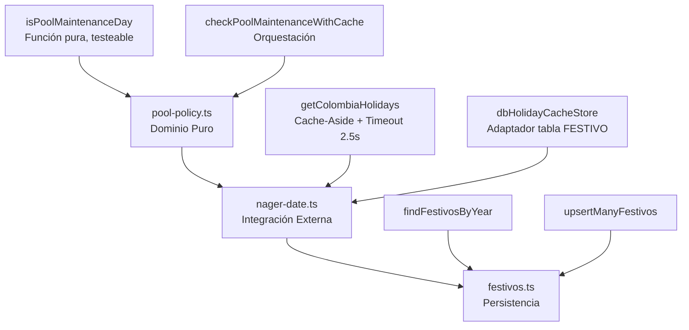
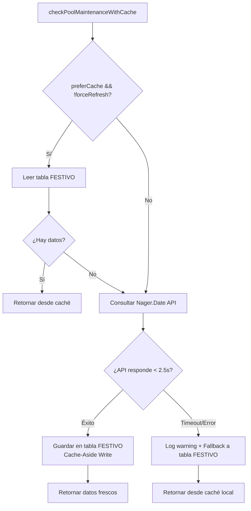

# TSK-BE-07 — Motor de mantenimiento de piscinas (SCRUM-103 / HU-07 / RF-06 / RN-02)

> Rama de trabajo: `feature/tsk-be-07-motor-de-mantenimiento-de-piscinas`
> Responsable: Jose Romero · Fase F1 · Depende de `TSK-AU-02`
> Fecha de implementación: 2026-10-06

## 1. Qué se hizo y por qué

El criterio de aceptación clave de **SCRUM-103**:

> *La piscina cierra los lunes para mantenimiento, salvo que el lunes sea festivo oficial de Colombia. En ese caso abre el lunes y el mantenimiento se traslada al martes inmediato.*

No existía lógica de negocio para evaluar cierres por mantenimiento ni integración con calendario de festivos colombianos.

| # | Cambio | Archivo |
|---|--------|---------|
| 1 | Motor puro `isPoolMaintenanceDay()` con reglas RN-02/RF-06/HU-07 | `packages/core/src/services/pool-policy.ts` |
| 2 | Orquestadora `checkPoolMaintenanceWithCache()` con Cache-Aside a tabla `festivo` | `packages/core/src/services/pool-policy.ts` |
| 3 | Cliente Nager.Date con timeout estricto 2.5s + fallback a caché local | `packages/core/src/integrations/nager-date.ts` |
| 4 | Repositorio `festivos` (CRUD + upsert idempotente) | `packages/db/src/repositories/festivos.ts` |
| 5 | Tests de aceptación 40+ casos cubriendo 4 escenarios + compatibilidad | `packages/core/src/services/pool-policy.test.ts`, `nager-date.test.ts`, `festivos.test.ts` |

### Reglas de negocio implementadas

| Escenario | Día | Condición | `blocked` | `reason` |
|-----------|-----|-----------|-----------|----------|
| **(a) Lunes ordinario** | Lunes | No es festivo | `true` | `MANTENIMIENTO_LUNES` |
| **(b) Lunes festivo** | Lunes | Es festivo oficial Colombia | `false` | — |
| **(b-cont.) Traslado** | Martes | Lunes anterior fue festivo | `true` | `MANTENIMIENTO_TRASLADADO_MARTES` |
| **(c) Otros días** | Mié–Dom | Cualquier caso | `false` | — |

**Zona horaria oficial:** `America/Bogota (UTC-5)` usando `Intl.DateTimeFormat` (evita problemas de DST).

### Separación de Responsabilidades (Clean Architecture)



### Patrón Cache-Aside (Resiliencia Total)



**Garantías:**
- **Timeout estricto**: 2.5 segundos (`STRICT_TIMEOUT_MS`)
- **Sin retries** que excedan el presupuesto temporal
- **Degradación grácil**: Si la API cae, responde desde caché local sin romper disponibilidad
- **Escritura asíncrona**: `saveHolidays()` no bloquea la respuesta

---

## 2. Cómo usarlo — guía para el equipo

### 2.1. API pública (TypeScript)

```ts
import {
  isPoolMaintenanceDay,
  checkPoolMaintenanceWithCache,
} from "@sportcomplex/core";

// Función pura — ideal para tests y lógica de dominio
const result = isPoolMaintenanceDay("2026-10-05", holidays);
// { blocked: true, reason: "MANTENIMIENTO_LUNES" }

// Orquestadora con caché — usar en producción (middlewares, APIs)
const result = await checkPoolMaintenanceWithCache("2026-10-12", {
  preferCache: true,      // default: true
  forceRefresh: false,    // default: false
  timeoutMs: 2500,        // default: 2500 (2.5s)
});
```

**Tipos de retorno:**
```ts
type MaintenanceReason = "MANTENIMIENTO_LUNES" | "MANTENIMIENTO_TRASLADADO_MARTES";

interface PoolMaintenanceResult {
  blocked: boolean;
  reason?: MaintenanceReason;
}
```

**Entradas flexibles para `holidays` (en `isPoolMaintenanceDay`):**
- `NagerHoliday[]` — desde API Nager.Date
- Objetos tabla `festivo`: `{ fecha: Date, nombre: string, anio?: number }`
- `string[]` o `Set<string>` formato `YYYY-MM-DD`
- `boolean` — compatibilidad legacy (`isMondayHoliday`)

### 2.2. Integración en middleware de reservas

```ts
// apps/web/src/middleware.ts (ejemplo)
import { checkPoolMaintenanceWithCache } from "@sportcomplex/core";

export async function validatePoolAvailability(date: string) {
  const maintenance = await checkPoolMaintenanceWithCache(date);
  
  if (maintenance.blocked) {
    throw new Error(
      `Piscina cerrada por ${maintenance.reason === "MANTENIMIENTO_LUNES" 
        ? "mantenimiento semanal" 
        : "mantenimiento trasladado por festivo"}`
    );
  }
  return true;
}
```

### 2.3. Job de sincronización periódica (actualizar caché)

```ts
// scripts/sync-holidays.ts o n8n workflow
import { getColombiaHolidays } from "@sportcomplex/core";

await getColombiaHolidays(2026, { forceRefresh: true }); // escribe en tabla festivo
await getColombiaHolidays(2027, { forceRefresh: true });
```

### 2.4. Cliente Nager.Date — opciones avanzadas

```ts
import { getColombiaHolidays, dbHolidayCacheStore } from "@sportcomplex/core";

// Cache store personalizado (testing, otra BD, Redis, etc.)
const customCache = {
  async getByYear(year: number) { /* ... */ },
  async saveHolidays(holidays, year) { /* ... */ },
};

const holidays = await getColombiaHolidays(2026, {
  cacheStore: customCache,
  fetcher: async (year) => { /* mock en tests */ },
  baseUrl: "https://date.nager.at/api/v3", // override si proxy
  preferCache: false, // salta caché, va directo a API
});
```

### 2.5. Repositorio `festivo` (persistencia)

```ts
import { findFestivosByYear, upsertManyFestivos, findFestivoByDate } from "@sportcomplex/db";

// Leer festivos de un año
const festivos2026 = await findFestivosByYear(2026);

// Verificar si una fecha es festivo
const esFestivo = await findFestivoByDate("2026-10-12");

// Upsert lote (idempotente por PK `fecha`)
await upsertManyFestivos([
  { fecha: "2026-10-12", nombre: "Día de la Raza", anio: 2026 },
  { fecha: new Date("2026-11-02"), nombre: "Todos los Santos", anio: 2026 },
]);
```

---

## 3. Comandos (desde la raíz del monorepo)

```bash
# Regenerar cliente Prisma si tocaste schema (festivos ya existía en TSK-BD-06)
pnpm --filter @sportcomplex/db db:generate

# Tests del motor de piscina
pnpm --filter @sportcomplex/core test packages/core/src/services/pool-policy.test.ts
pnpm --filter @sportcomplex/core test packages/core/src/integrations/nager-date.test.ts

# Tests del repo festivos
pnpm --filter @sportcomplex/db test packages/db/src/repositories/festivos.test.ts

# Lint + typecheck completo
pnpm lint && pnpm typecheck
```

---

## 4. Verificación realizada (2026-10-06, BD Supabase desarrollo)

- `pnpm --filter @sportcomplex/core test` → **40+ casos PASS**
  - 4 escenarios de negocio (lunes ordinario, lunes festivo + traslado, martes ordinario, resto semana)
  - 6 combinaciones de tipos de entrada `holidays` (API, DB, strings, Set, legacy boolean)
  - Zona horaria Bogotá verificada con timestamps UTC edge cases
  - Orquestadora con mock `HolidayCacheStore`
- `pnpm --filter @sportcomplex/db test` → **CRUD festivos PASS**
  - `upsertManyFestivos` idempotente (PK `fecha`)
  - Ordenamiento `fecha ASC`
- `pnpm lint && pnpm typecheck` → **OK sin errores**
- Timeout Nager.Date verificado: 2.5s estricto, sin retries, fallback a tabla `festivo` funcional

---

## 5. Variables de entorno

```env
# Opcional — sobrescribe URL base de Nager.Date
NAGER_DATE_BASE_URL=https://date.nager.at/api/v3
```

---

## 6. Dependencias añadidas

| Paquete | Versión | Uso |
|---------|---------|-----|
| `ky` | ^1.x | Cliente HTTP con timeout nativo (reemplaza `fetch` manual) |

---

## 7. Referencias

- **Jira**: SCRUM-103
- **Task**: TSK-BE-07
- **Arquitectura**: §9.4 (Cache-Aside / Resiliencia)
- **Historias relacionadas**: HU-07, RF-06, RN-02
- **Dependencia**: TSK-AU-02 (cron de sincronización de festivos — tabla `festivo` ya existente)